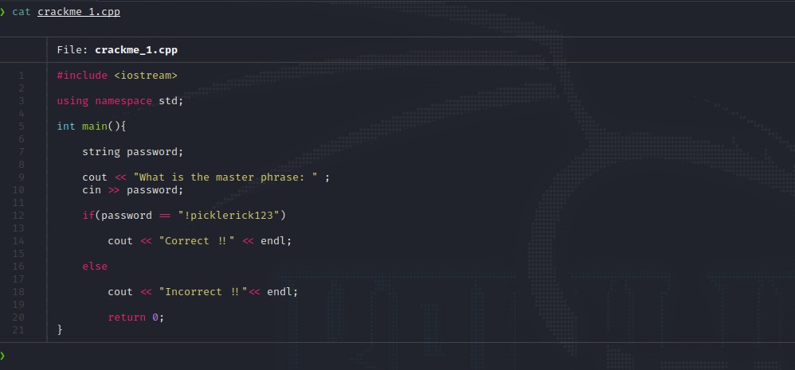
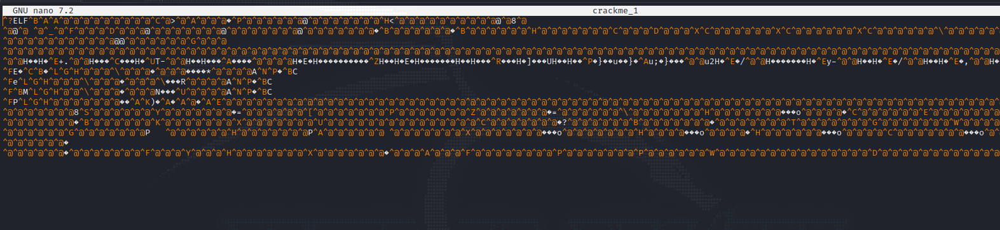
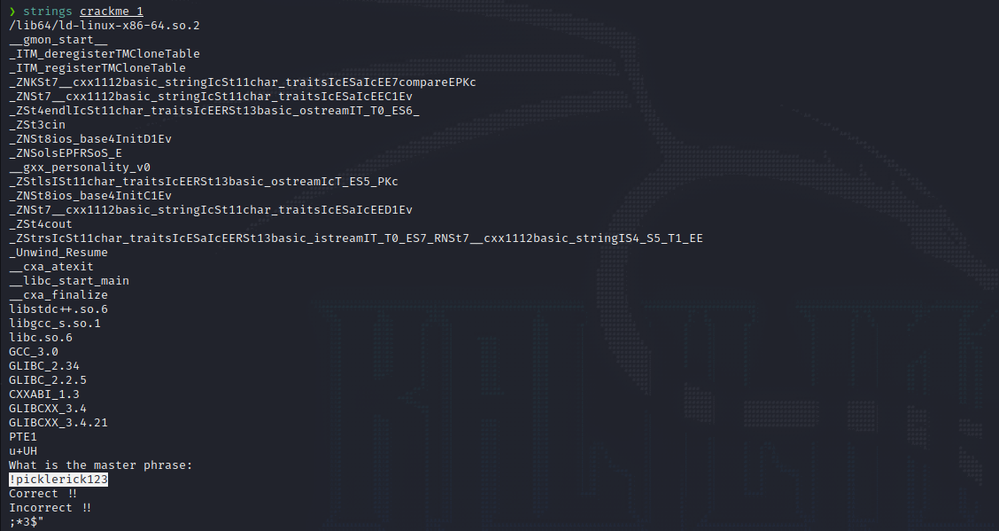
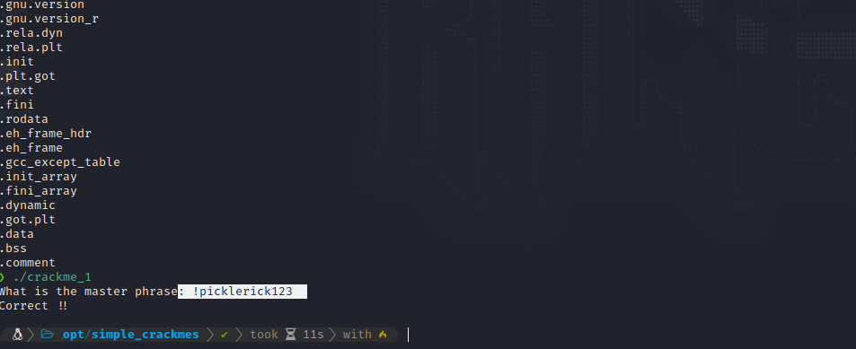
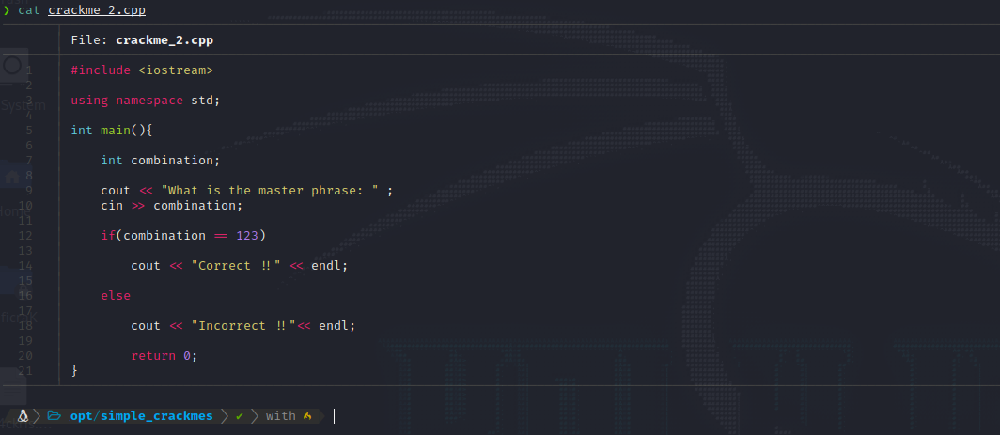
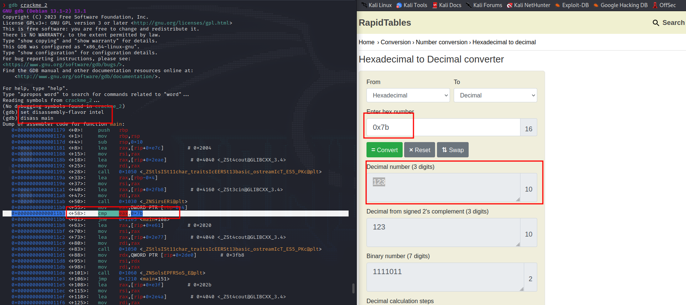
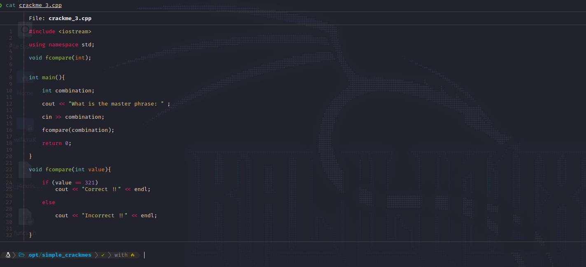
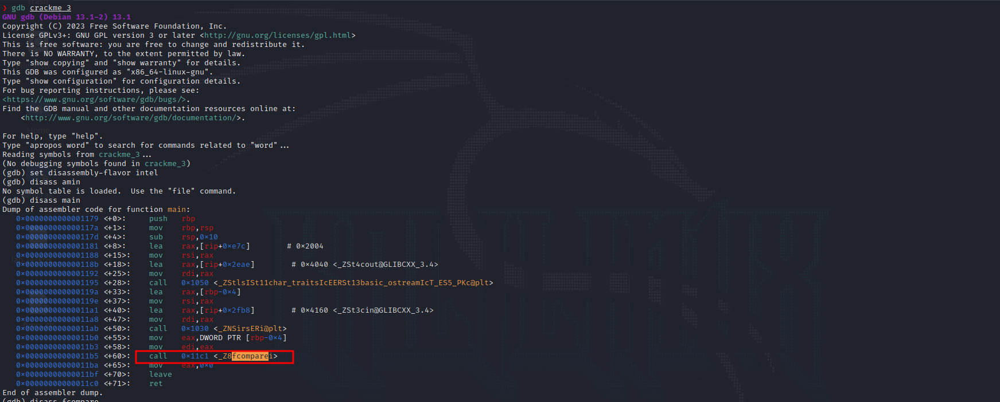
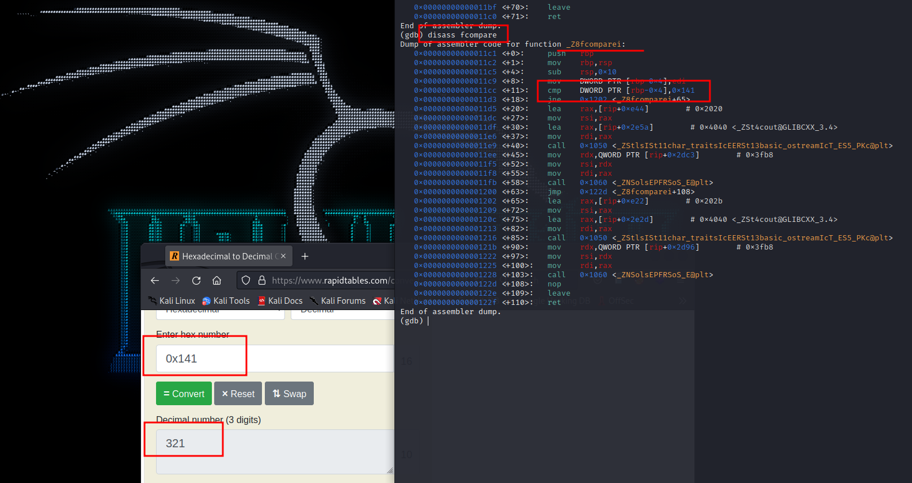

# Reversing

## What is Reverse Engineering?

* Reverse engineering is used to uncover hidden or undocumented features and vulnerabilities in software, hardware, and systems. By understanding how a system works, security professionals can identify weaknesses that would allow attackers to gain access or cause damage.

## Crakmes

### Crackme 1

<figure><figcaption></figcaption></figure>


```cpp
#include <iostream>

using namespace std;

int main(){

    string password;

    cout << "What is the master phrase: " ;
    cin >> password;

    if(password == "!picklerick123")

        cout << "Correct !!" << endl;

    else

        cout << "Incorrect !!"<< endl;

        return 0;
}
```


Let's start by reversing this code binary using _**strings.**_

#### What it's Strings?

_**Strings is a binary that get all the ascii characters of a binary and list it in order so we can see what some of the characters are that contain the binary.**_

<figure><figcaption></figcaption></figure>

Here you can see that there's a mess of characters around, let's use strings to see it more clearly.

<figure><figcaption></figcaption></figure>

Getting a look, we can see the first line that once the program starts says "**What is the mater phrase?**" following by a string that we can suppose that its the master phrase.

<figure><figcaption></figcaption></figure>

As simple as that we found the key of the first crackme.

### Crackme 2

<figure><figcaption></figcaption></figure>

Know we're not looking for a **string** pass phrase we are looking of a number's combination, it changes a little bit.


```cpp
#include <iostream>

using namespace std;

int main(){

    int combination;

    cout << "What is the master phrase: " ;
    cin >> combination;

    if(combination == 123)

        cout << "Correct !!" << endl;

    else

        cout << "Incorrect !!"<< endl;

        return 0;
}
```



Let's use GDB Linux debugger to see what the program is doing at low level programming in other words assembly.

**What it's GDB Linux Debugger?**

**This is a powerful source-level debugging package that lets you see what is going on inside your program. You can step through the code, set breakpoints, examine and change variables, and so on.**

<figure><figcaption></figcaption></figure>

First, we need to say that we want to disassembly the main function so we can see what is happening like **(cmp,jmp,mov, etc).**&#x20;

Once we start looking, we see that there is a comparation between **EAX** and **0x7b.**

When you convert **0x7b** to hexadecimal it's equivalent to **123**, the secret pass phrase.

### Crackme 3

<figure><figcaption></figcaption></figure>

**Now what happen when there is no direct comparation in the program?**


```cpp
#include <iostream>

using namespace std;

void fcompare(int);


int main(){

    int combination;

    cout << "What is the master phrase: " ;

    cin >> combination;

    fcompare(combination);

    return 0;

}

void fcompare(int value){

    if (value == 321)
        cout << "Correct !!" << endl;

    else

        cout << "Incorrect !!" << endl;


}
```


Same as the second crackme, we disassembly the main function and look for a call to an interesting function to continue seeing what it does.

<figure><figcaption></figcaption></figure>

In this case you'll see that there is the **fcompare** function so, continue to disassembly the function.

<figure><figcaption></figcaption></figure>

Once you start looking the fcompare function you'll see that there is a comparison and the hexadecimal that is comparing to, just copy and paste to the converter to see the equivalation.

## Tools for Reversing










