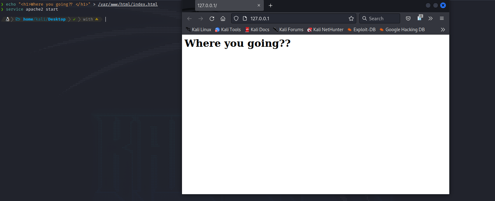

# DNS spoofing + apache2

<figure><figcaption></figcaption></figure>

First, set you _html page_ and start the _**apache2**_ service.

<figure><figcaption></figcaption></figure>

Now, configure the _**`/etc/ettercap/etter.conf`**_ and set these **2** variables to **0**.

<figure><figcaption></figcaption></figure>

Third step, open the _**`/etc/ettercap/etter.dns`**_ and set the domains you want to spoof.

<figure><figcaption></figcaption></figure>

Now start an _ARP spoof_ with **ettercap**.

<figure><figcaption></figcaption></figure>

Later than, go to _plugins_ and double click the **dns\_spoof** plugin.


This will **not** work if the website you are spoofing haves **HSTS** security.

