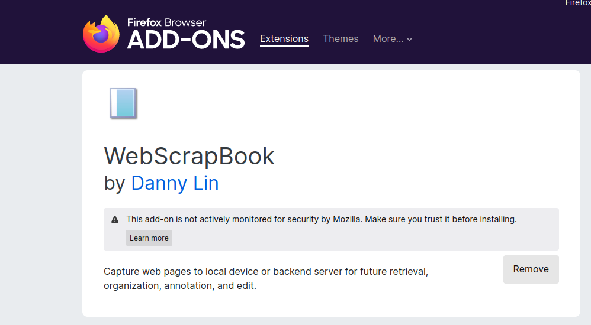
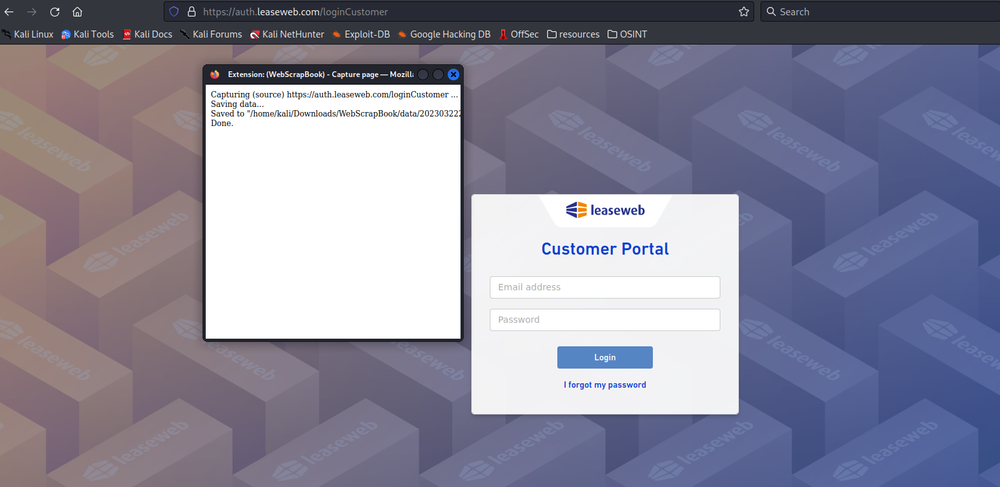
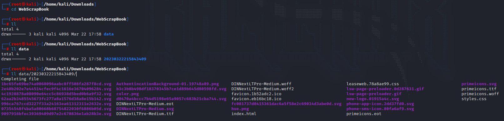
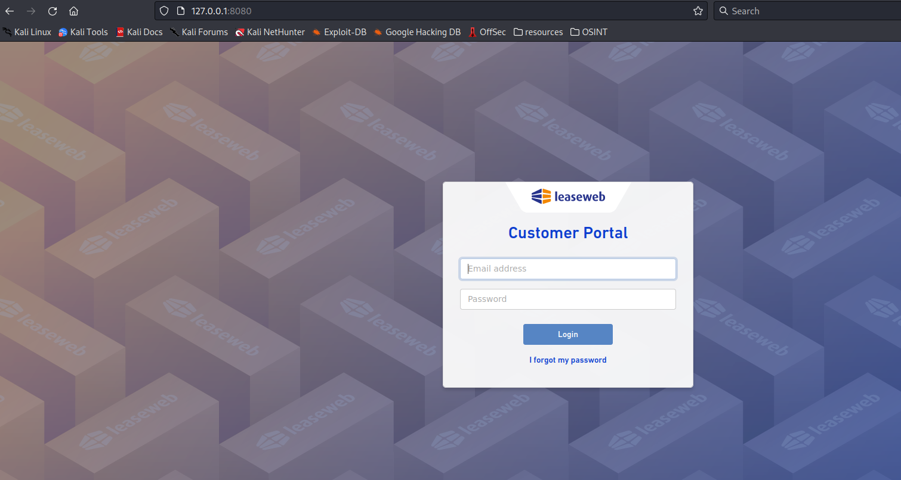
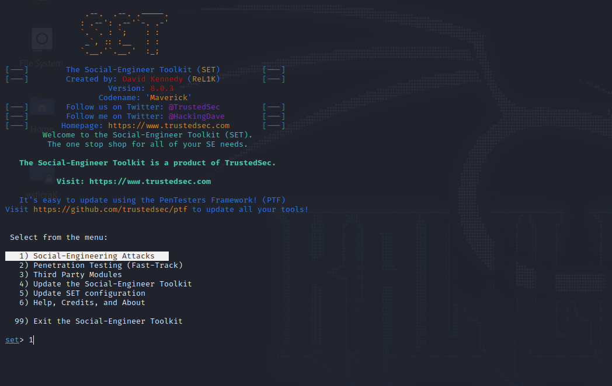
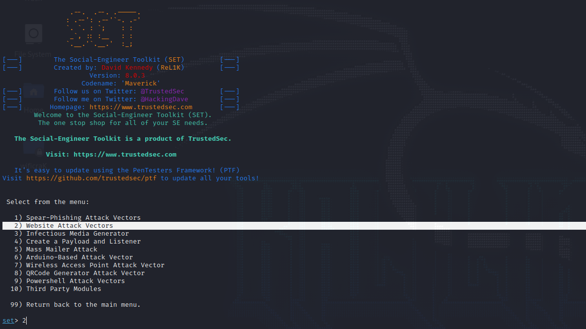
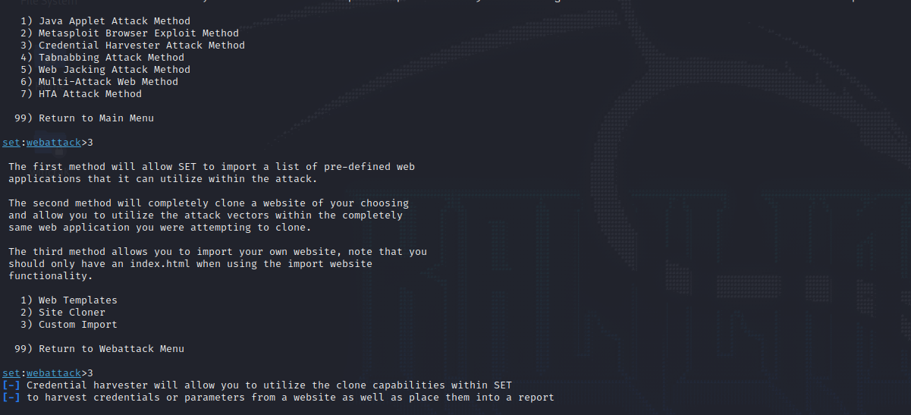
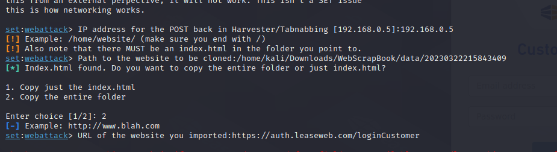
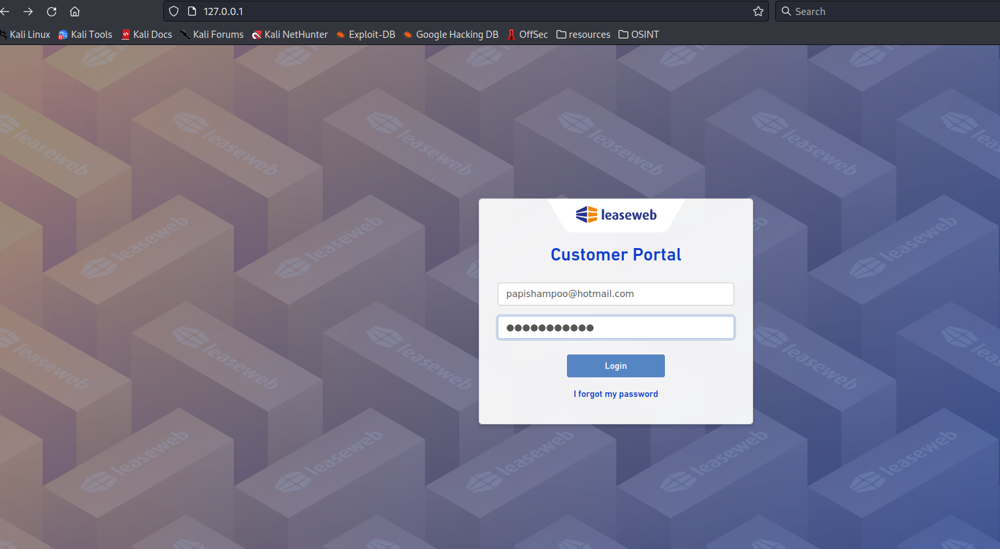
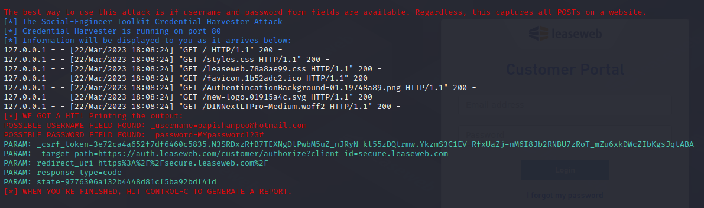

# Creating Fake Login Website

## Download The Login Page

* In order to clone a website login, use _**Webscrapbook**_ to download all the login page and save it in a folder.

<figure><figcaption></figcaption></figure>

* Download a login page click on the webscrapbook logo and click in _**Capture Tabs (Source)**_.

<figure><figcaption></figcaption></figure>

* Now that you downloaded the login page go to the folder you save it and try it with **php 0.0.0.0:80** to see if everything it's downloaded correctly.

<figure><figcaption></figcaption></figure>

<figure><figcaption></figcaption></figure>

* Here you can see the login page in my local machine.

## Setting The Credential Harvester with (Setoolkit)

* Type **setoolkit** to run it.&#x20;

<figure><figcaption></figcaption></figure>

* Choose the option 1

<figure><figcaption></figcaption></figure>

* Choose the option 2

<figure><figcaption></figcaption></figure>

* Choose the option 3

<figure><figcaption></figcaption></figure>

* Now here you will configure the credential harvester.
* Pass your **IP,** set the route where you have downloaded the login website, and set the option 2.
* Finally copy the original URL of the website and paste it.

<figure><figcaption></figcaption></figure>

* Now our fake login website is working, if we send this to somebody it will see this and once, they put their credentials we will see it from the terminal.

<figure><figcaption></figcaption></figure>

* As our last step, now we can send this to our targets.
