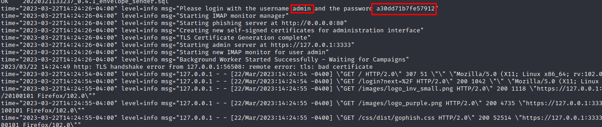
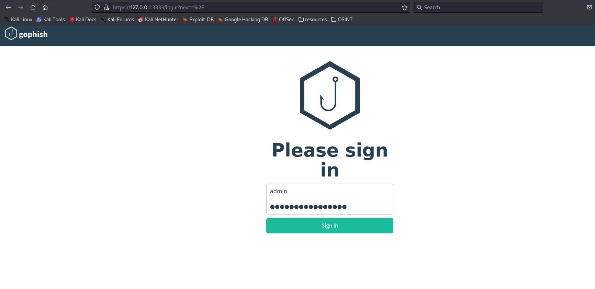
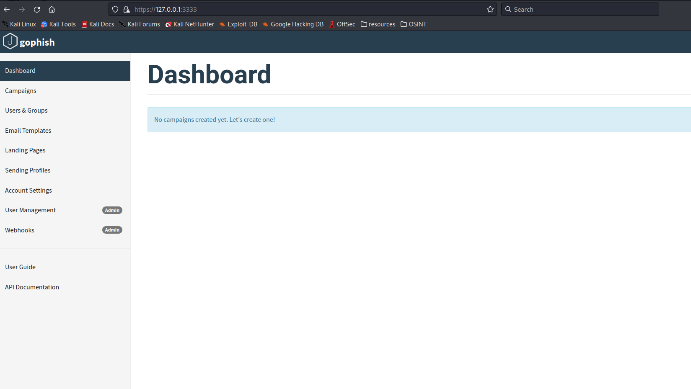

# Gophish

**Gophish** is an **open-source phishing toolkit** designed for businesses and penetration testers. It provides the ability to quickly and easily setup and execute phishing engagements and security awareness training.&#x20;

### Installation

```bash
git clone https://github.com/gophish/gophish.git # Download the github repository
cd gophish
go build # Run this to build the binary
./gophish # Now run the binary
```

### Setup

* Once you start **gophish**, you will see the credentials to login and change the password.

<figure><figcaption></figcaption></figure>

* Use those credentials in **https://127.0.0.0:3333**.

<figure><figcaption></figcaption></figure>

* Once you pass those credentials just change the password and it will go directly to the login page.

<figure><figcaption></figcaption></figure>

### Overview

#### Campaigns

* This would be anything active that you have running like a Phishing Campaigns.

#### Users & Groups

* Where you submit any users that you're forwarding a phishing campaign to.
* Let's say you're targeting an organization and you use tools like **LinkedInt** to pool employees. You can pass the **csv.** file to **gophish** , and target 1k people within seconds.

#### Email Templates

* This is where you would create email templates. Those actual phishing emails that you forward to people you can store them.

#### Landing Page

* Here you can **create a phishing website like Facebook** or whatever you want.

#### Sending Profiles

* This where you store all of your personal domains. You can host a lot of domains here so; you can send tons of different phishing emails.

