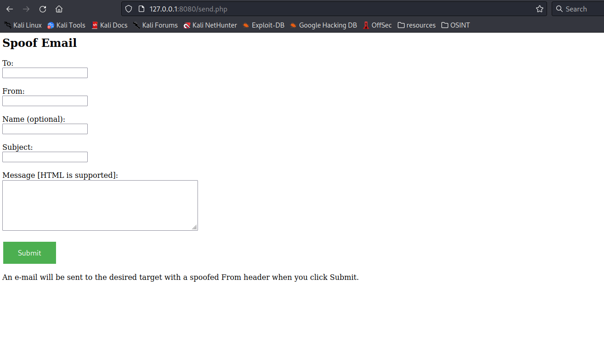

# Setting Your Own SMTP server

First, to set up our SMTP server to conduct phishing attacks we need to get a **VPS** first so we can use the following script.

Once we have our server, just upload the script and run a php server on the directory that locates the **send.php** .

Use **php -S 0.0.0.0:8080** to run the web server.


```php
<?php

if (isset($_POST["send"])) {

	$to = $_POST["to"];
	$subject = $_POST["subject"];
	$message = $_POST["message"];
	$from = $_POST["from"];
	$name = $_POST["name"];

	if (!(filter_var($to, FILTER_VALIDATE_EMAIL) && filter_var($from, FILTER_VALIDATE_EMAIL))) {
		echo "Email address inputs invalid";
		 die();
	} 

	$header = "From: " .  $name . " <" . $from . ">\r\nMIME-Version: 1.0\r\nContent-type: text/html\r\n";

	$retval = mail ($to, $subject, $message, $header);

	if ($retval) {
		echo "Email sent.";
	} else {
		echo "Email did not send. Error: " . $retval;
	}
} else {
	echo 
	'<html>
		<head>
			<style> 
				input[type=submit] {
				  background-color: #4CAF50;
				  border: none;
				  color: white;
				  padding: 14px 32px;
				  text-decoration: none;
				  margin: 4px 2px;
				  cursor: pointer;
				  font-size: 16px;
				}
			</style>
		</head>
		<body>

			<h2>Spoof Email</h2>

			<form action="/send.php" method="post" id="emailform">
			  <label for="to">To:</label><br>
			  <input type="text" id="to" name="to"><br><br>
			  <label for="from">From:</label><br>
			  <input type="text" id="from" name="from"><br><br>
			  <label for="name">Name (optional):</label><br>
			  <input type="text" id="name" name="name"><br><br>
			  <label for="subject">Subject:</label><br>
			  <input type="text" id="subject" name="subject"><br><br>
			  <label for="message">Message [HTML is supported]:</label><br>
			  <textarea rows="6" cols="50" name="message" form="emailform"></textarea><br><br>
			  <input type="hidden" id="send" name="send" value="true">
			  <input type="submit" value="Submit">
			</form> 

			<p>An e-mail will be sent to the desired target with a spoofed From header when you click Submit.</p>

		</body>
	</html>' ;
}
?>

```


<figure><figcaption></figcaption></figure>
