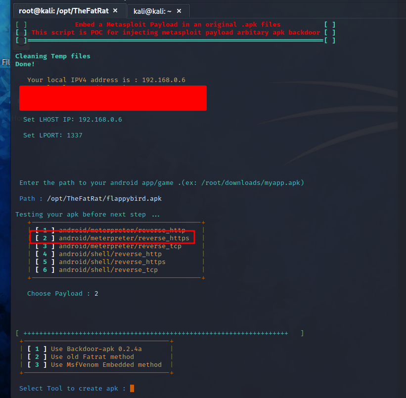

# Backdooring An APK

<figure><figcaption></figcaption></figure>

* In this case I will backdoor flappy bird using TheFatRat so, we can trick our victim more easily and get access to its phone.

<figure><figcaption></figcaption></figure>

* TheFatRat have different options to embed our malicious code so, you have options to choose.
