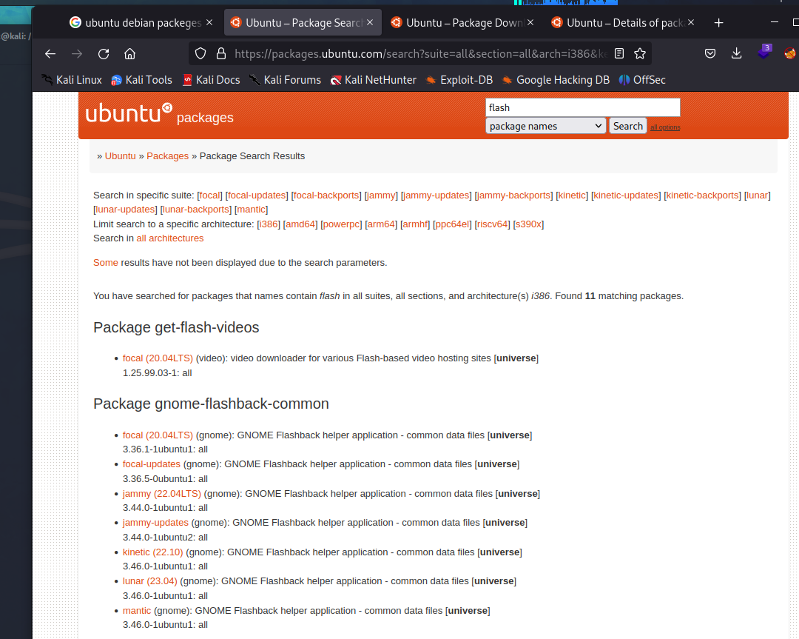
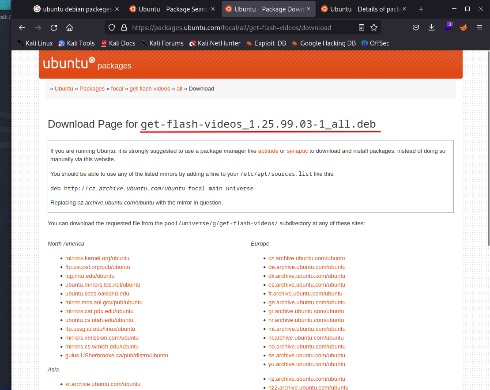
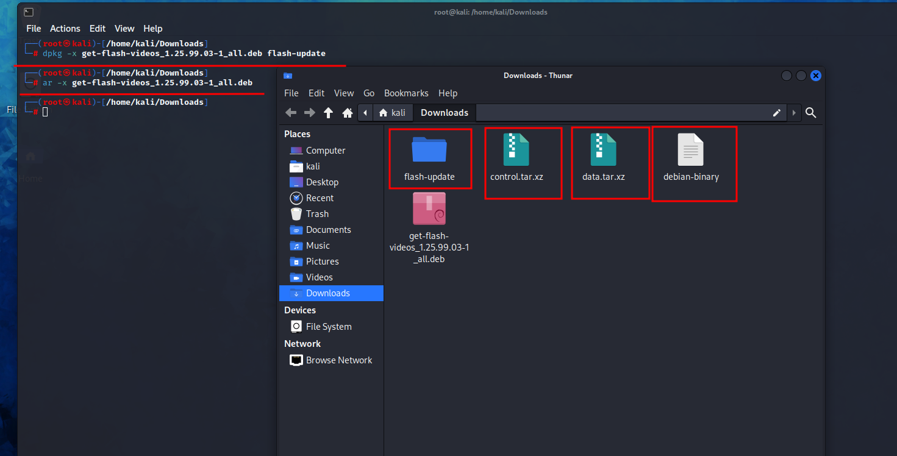
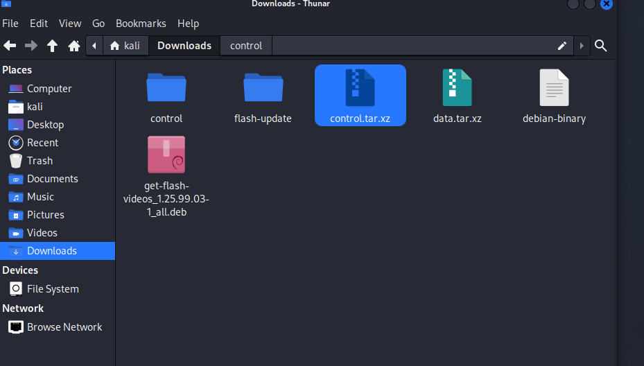
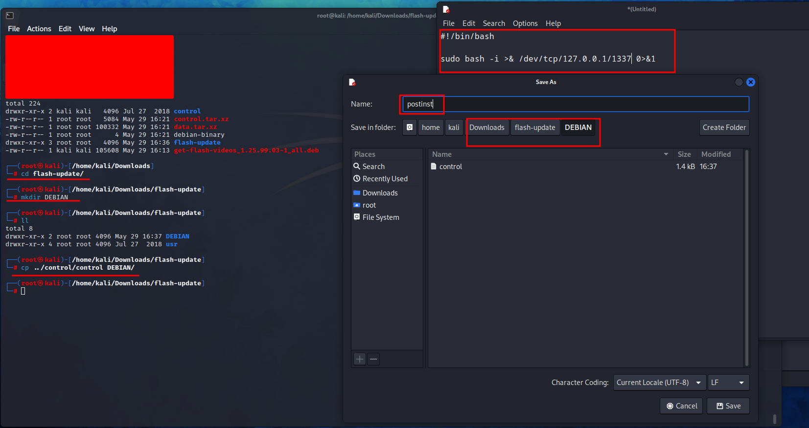

# Embedding Evil Code in a Legitimate Linux Package

<figure><figcaption></figcaption></figure>

Let's start by downloading a package, in this case I will use an Ubuntu package.

<figure><figcaption></figcaption></figure>

Preferably choose a flash package so, you can trick the user to download it more easily saying that its a system update.

<figure><figcaption></figcaption></figure>

* Once you download the package, continue to extract the files of it.

<figure><figcaption></figcaption></figure>

* Now we need to extract this file called "**control".**
* Once the control file is extracted copy a file from its directory called control too and move it to a new directory inside the _**flash-update**_ directory called **"DEBIAN".**

<figure><figcaption></figcaption></figure>

* Inside the **DEBIAN** directory create a bash backdoor and name it **"postinst"**.
* Once you create the postinst file use dpkg to build the deb file.
