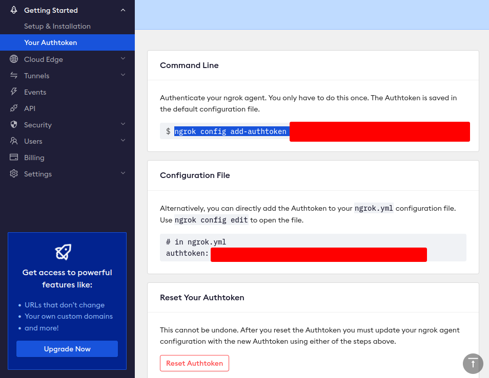
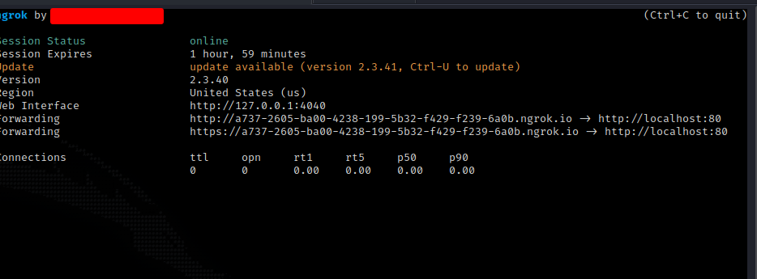

# Ngrok

* To start using **Ngrok**, first create an account and install it using the **.deb** file or using **apt**.
* &#x20;Once install, copy the commands to insert you **Authtoken**.

<figure><figcaption></figcaption></figure>

* Now we need to specify what type of **listener/server** we want to use.

<figure><figcaption></figcaption></figure>

* In this I'll we be exposing my port 80 throw internet.
* You can make a **TCP** listener too as well, useful to create **backdoors**, **C\&C**, etc.
