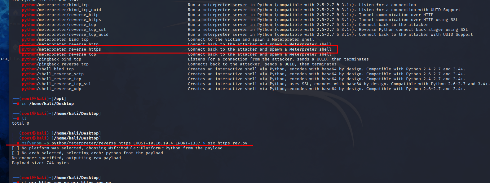

# Using Msfvenom

<figure><figcaption></figcaption></figure>

* A simple way to get access to _**OS X**_ systems is by taking advantage of the binary language interpreters, for example _python_, _php_, _ruby_, _etc_.
* Now we need to get this executed on the victim machine.
