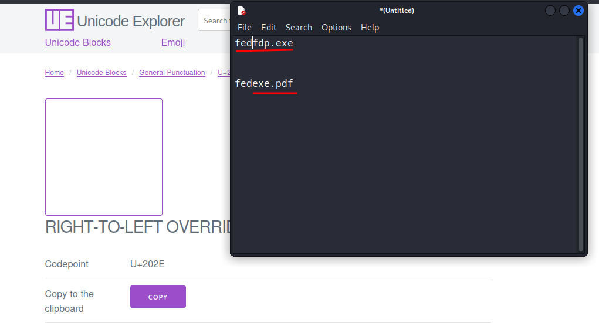

# Spoofing file extensions

* To spoof the file extension of a file lookup for the Unicode of **right-to-left** char.



* Once you copy it paste it before on the extensions you write in backwards to make the file name look like in the image below.

<figure><figcaption></figcaption></figure>

* Some browsers will detect the right-to-left, and it will URL encode it.
* To solve this problem, compress the file with a similar name of the original file, so now you can pass the link to the victim, and it will not be so suspicious.
