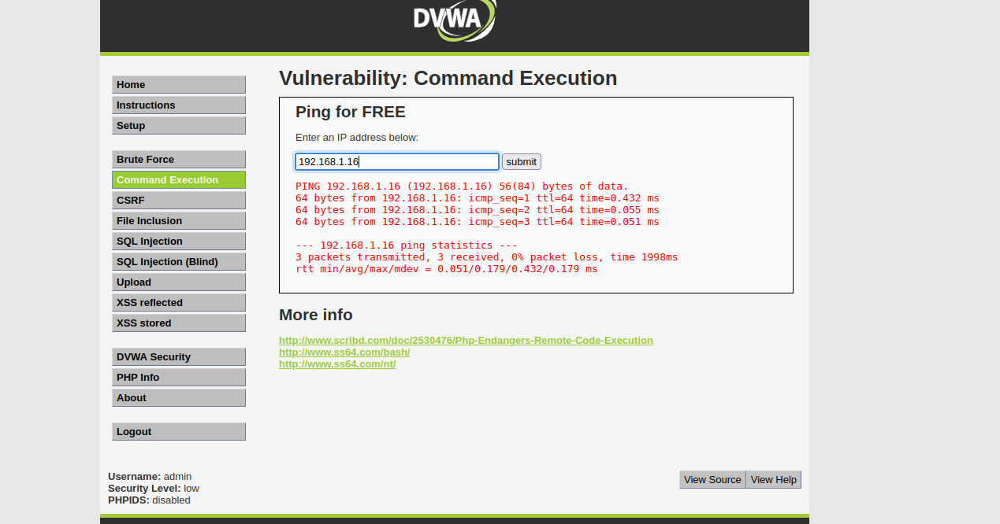
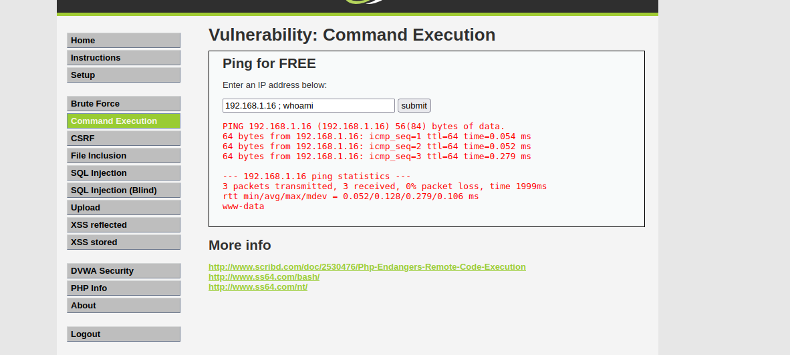
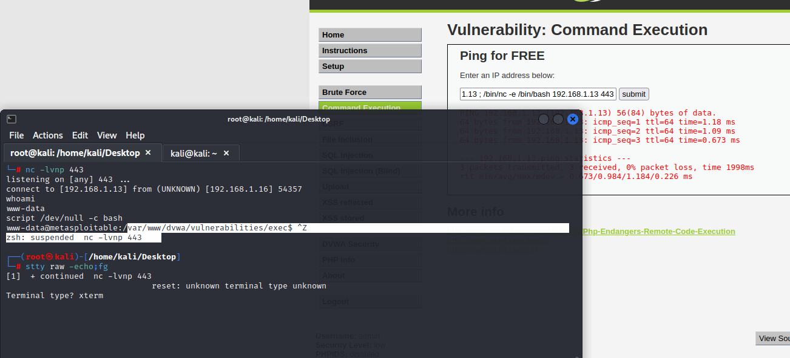

# Code Execution

<figure><figcaption></figcaption></figure>

This type of vulnerability lets us do:

* Allows an attacker to execute OS commands on the server.
* Can be used to get a **reverse shell or, upload any file using wget command**.

Example Using DVWA:

<figure><figcaption></figcaption></figure>

* Here we have an input on the web application that pings the IP we provided to it.

<figure><figcaption></figcaption></figure>

* Supposing that behind is something like **"ping $IPvariable"** as a command.
* We can try to exploit using a colon ( **;** ) or a pipe ( **|** ) followed by the command we want to execute.
* So, the code behind will look something like this: (**"ping \<IP> ; whoami")** or **("ping \<IP> | whoami").**

<figure><figcaption></figcaption></figure>

* Here I wanted to gain access to the server so supposing it haves _**netcat**_, I try to get a shell with.
* Successfully gain access to the server.

More explanation examples and details in the following below.


[os-command-injection](../../welcome/writeups/portswigger/os-command-injection/)

