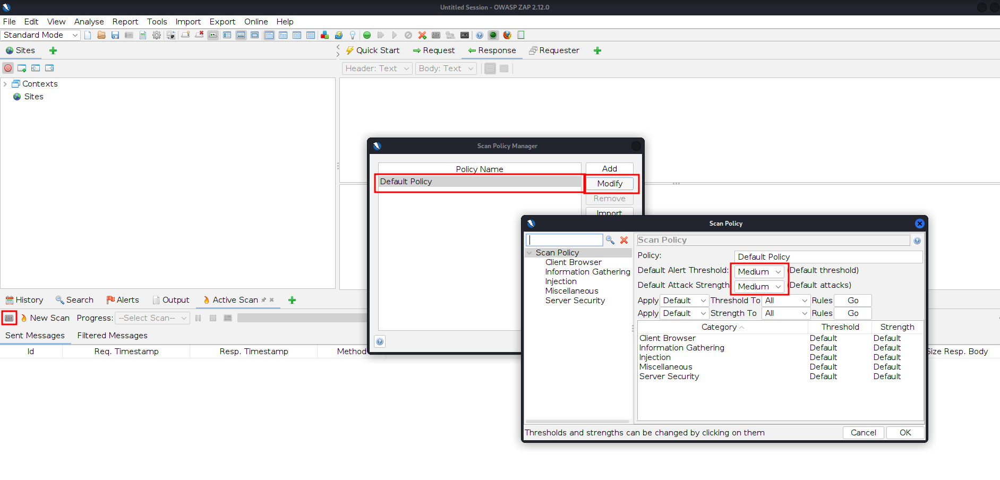
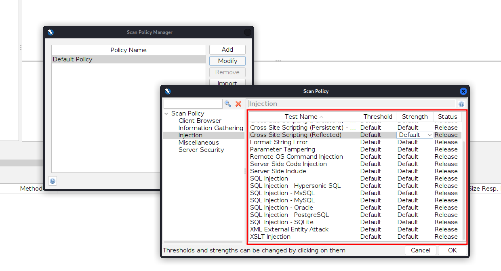
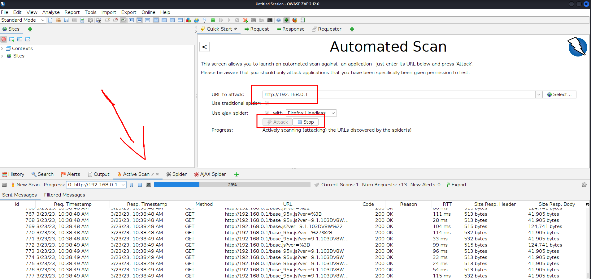
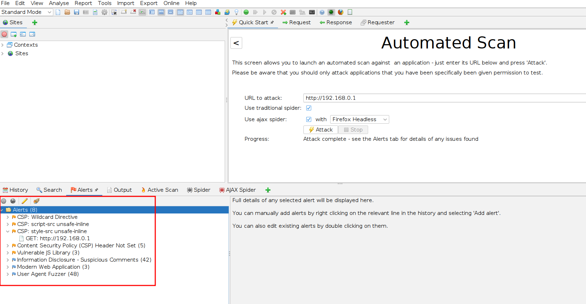

# Discovering Vulnerabilities using OWASP ZAP

**Zed Attack Proxy (ZAP)** is a free, open-source penetration testing tool being maintained under the umbrella of the Open Web Application Security Project (OWASP). ZAP is designed specifically for testing web applications and is both flexible and extensible.

<figure><figcaption></figcaption></figure>

* To run a vulnerability scan with click on the square in the left, and if you want to click on default policy and modify.

<figure><figcaption></figcaption></figure>

* In this option you will be seeing all the vulnerability scans that you can run and their level of strength.

<figure><figcaption></figcaption></figure>

* Once you set your configurations, start the attack and see how it is going.

<figure><figcaption></figcaption></figure>

* Here in the following image, you can see all the possible vulnerabilities to analyze them.
