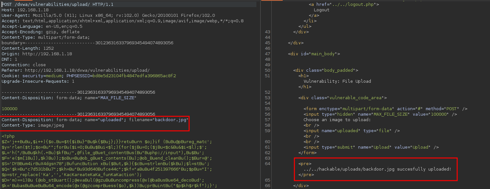

# File Upload

<figure><figcaption></figcaption></figure>

* This Type of vulnerability lets an attacker to get a reverse shell on the web server that is attacking, basically once the attacker can upload malicious files can do whatever they want.
* In the following, we are trying to upload a php file to the server to see if there is a check for this type of file.

<figure><figcaption></figcaption></figure>

<figure><figcaption></figcaption></figure>

* Here we see that we can upload php files successfully, so let's create a web backdoor with weevely.
* If we put the path given in the url you will see and execute the fiile you upload.

<figure><figcaption></figcaption></figure>

<figure><figcaption></figcaption></figure>

* To create a **weevely** backdoor, put the commands as it shows in the images.

<figure><figcaption></figcaption></figure>

* Once you uploaded your weevely backdoor, connect to it using the password you give it previously.
* This test was in the low level of **dvwa** there is no check to verify if it is a malicious file.
* In the image below, if we try to upload the same php file it will give you an error

<figure><figcaption></figcaption></figure>

* There are multiple ways to try to upload a malicious file and bypass the checker in the server.
* This time I will just rename my file **backdoor.jpg**, an uploaded, if did not work just do try an error with other things like, different file extension, size of file etc.

<figure><figcaption></figcaption></figure>

* Now were able connect back to the server using weevely.
