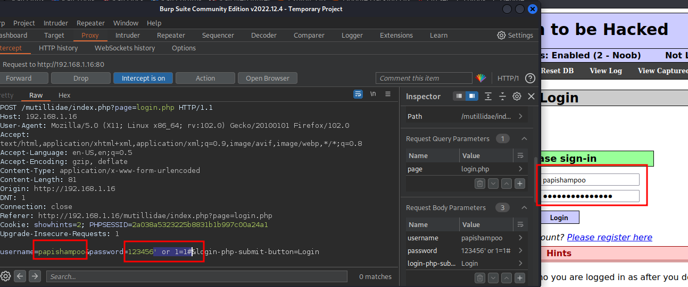

# SQL Injection

<figure><figcaption></figcaption></figure>

## What is SQL?

* **SQL** stands for **S**tructured **Q**uery **L**anguage.
* Most website use a database to store data
* Data like usernames, passwords, credit cards, post and so on, are stored in a database.

## What is an SQL Injection?

* Allows an attacker to interfere with the queries that an application makes to its database.
* A successful SQL injection attack can result in unauthorized access to sensitive data, such as passwords, credit card details, or personal user information.

## SQL Injection Login Bypassing

<figure><figcaption></figcaption></figure>

* Seeing the following we are trying to inject SQL commands to bypass this login successfully.
* In this bypass we're doing, we put a colon after the password **"123456"** and we use **"  'and 1=1# "** to inject our SQL command
* 1=1 it will take it like is True, and we will be able to bypass this login page.
* _After that we will successfully login as_ **papishampoo**.

More Information and examples in:


[sql-injection](../../welcome/writeups/portswigger/sql-injection/)


### Bypassing Filters

Bypass blacklisted spaces:

* \+
* /\*\*/
* comment = %23

Bypassing queries:

* uNiOn+SElect+1,2+%23
* UniOn/\*\***/SeLecT/**\*\*/%23

Example:

* \-1'UniOn/\*\***/SeLecT/\*\*/1,table\_name/\*\*/from/\*\*/infromation\_schema.tables/\*\*/where/\*\*table\_schema/\*\*/=/\*\*/' \<table\_name> '%23**
