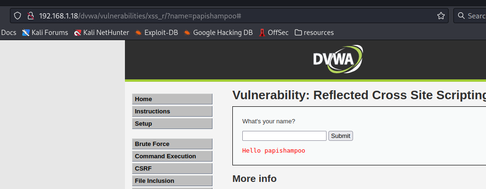
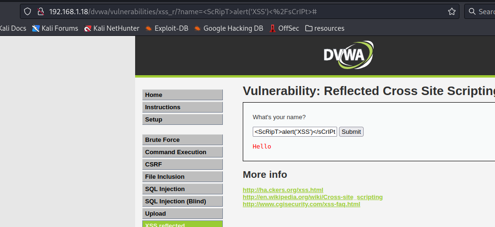
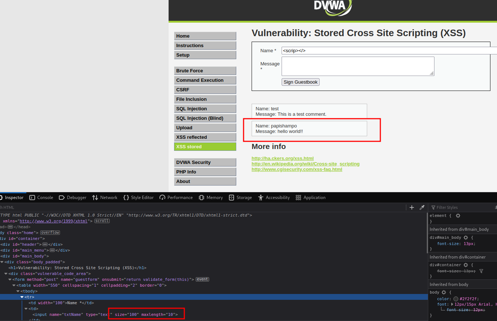
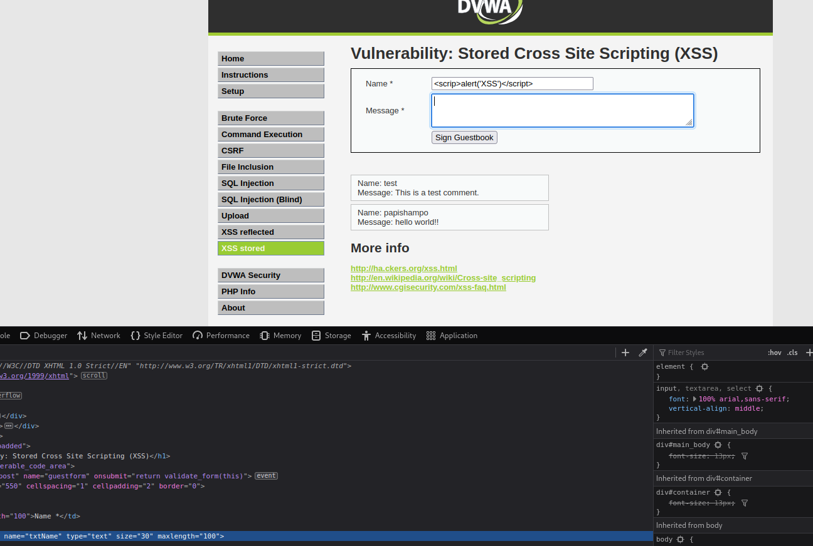
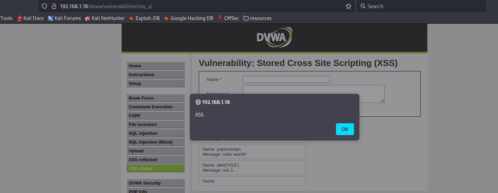
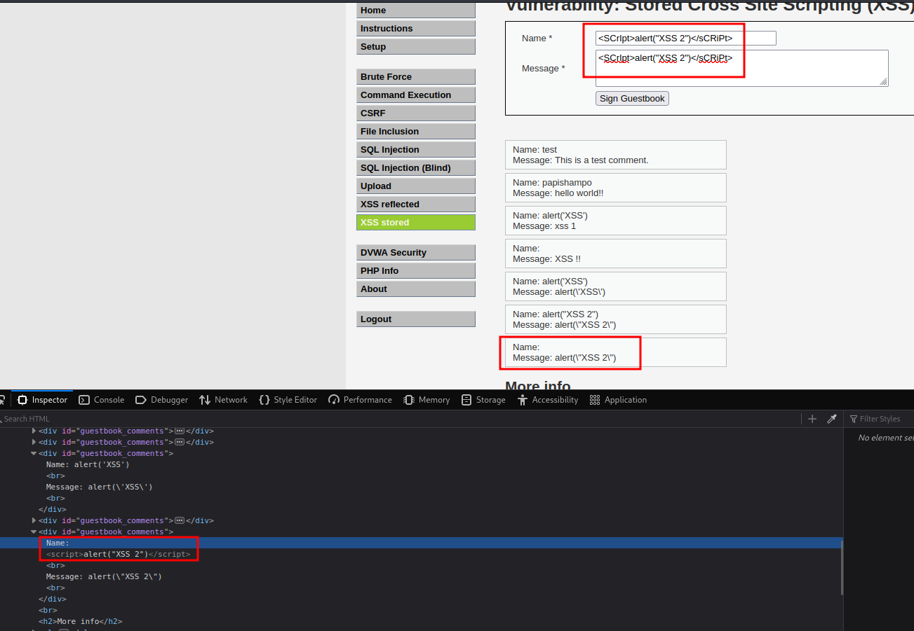

# XSS (Corss-site scripting)

<figure><figcaption></figcaption></figure>

## What is the impact of XSS vulnerabilities?

* Allows an attacker to inject **JS** code into the page.
* Code is executed on the **page loads**.
* Code is executed on the client machine **not the server**.

### Types of Cross-site scripting

* _Reflected XSS_
* _Persistent / Stored XSS_
* _DOM Based XSS_

### Reflected XSS demo.

<figure><figcaption></figcaption></figure>

* Here we see that the user input is showing up in the response.&#x20;

<figure><figcaption></figcaption></figure>

* If you input **JS** code, it may interpretate your input as code in the page.
* Thats why you see that alert gets executed.

### Reflected XSS Simple bypass.

<figure><figcaption></figcaption></figure>

* The simplest bypass you can do is using lowercases and uppercases as the following.

### Stored XSS demo

<figure><figcaption></figcaption></figure>

* Stored XSS are different because they are persistent, so you don't have to do anybody click on your malicious link.
* We Can see in the image above that we can see the output of what we input on the message box.
* In this specific case the length that we can just write is 10 chars minimum, just change it to 100 so you can write more than that, otherwise it will not work.

<figure><figcaption></figcaption></figure>

* Now if you test to do "_**\",**_ you will see that is vulnerable.
* This time is a stored XSS, so if a user navigates in this page it will pop up our XSS payload saying "XSS".

<figure><figcaption></figcaption></figure>

<figure><figcaption></figcaption></figure>

* In case it doesn't work there are a lot of different ways to exploit this vulnerability, it depends how well the JavaScript is designed.
* In the image above you are seeing that my first **"XXS 2"** it's been filtered and it's not letting me inject my code
* The solution right here is trying to bypass the filter somehow. Knowing that this is a simple bypass just do "_**\".**_
