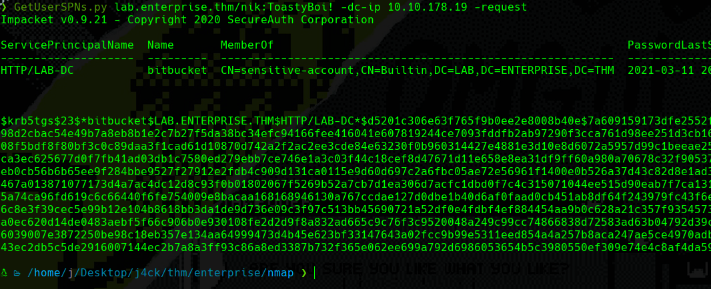

# Kerberoasting

<figure><figcaption></figcaption></figure>

**Requirements: User + Password**

## Kerberoasting Steps

The steps are simples and straight like in the image shown above.

1. Requests **TGT**, Provide NTLM hash (a password)
2. Receive **TGT** enc w/ **krbtgt** hash
3. Requests **TGS** for server (**Presents TGT**)
4. Receive **TGS** enc w/ server's account hash (**TGS received**)

Our goal with **kerberoasting** is to get the **TGS hash**, why we need the TGS hash? TGS hash contains the **NTLM password** of the users that are **SPNs** in the server, so we can crack that hash offline and get the respective user password.

### Execution

To run this attack, we need the following requirements:

* Valid User
* Valid Password

Use **GetUserSPNs.py** to run this:

<figure><figcaption></figcaption></figure>

### Cracking

```java
# Windows
hashcat64.exe -m 18200 Hashes.txt rockyou.txt

# Linux
john --wordlist rockyou.txt Hashes.txt --format=krb5tgs
hashcat -m 18200 -a 3 Hashes.txt rockyou
```
