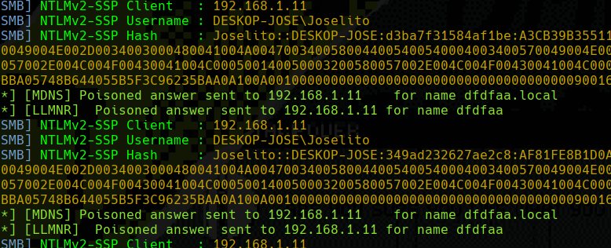

# LLMNR Poisoning

* **Link-Local Multicast Name Resolution** (LLMNR) is used to identify hosts when DNS does not work properly. This was previously known as **NetBIOS** (NBT-NS).
* **LLMNR** is vulnerable because the services require a username and NTLMv2 hash in order to function, an attacker can poison the network to capture the hash of the computer as you can see in the following image.

<figure><figcaption></figcaption></figure>

### Lab Scenario

* 2 Windows 10 Enterprise (Target 192.168.1.11)
* 1 Domain Controller 2019 (DC 192.168.1.7)

### How to perform the attack

This attack is easy to deploy, just this will run it.

```java
responder.py -I <interface> -rdwv
```

To understand better here is what the victim will be doing and seeing.

<figure><figcaption></figcaption></figure>

Here is the famous authentication that **LLMNR** does, now we respond to that **broadcast packet** using the **Responder** and have capture the **NTLMv2 hash**.

<figure><figcaption></figcaption></figure>

**Below we see the hashes !!** now we proceed to cracking them.

<figure><figcaption></figcaption></figure>
