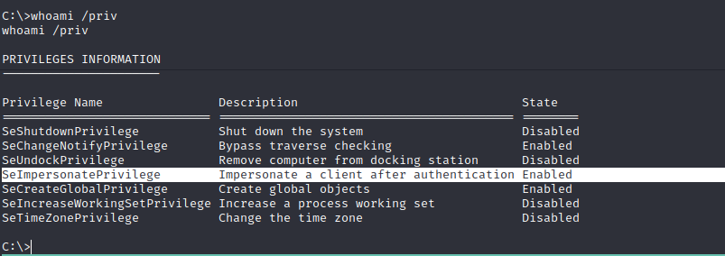
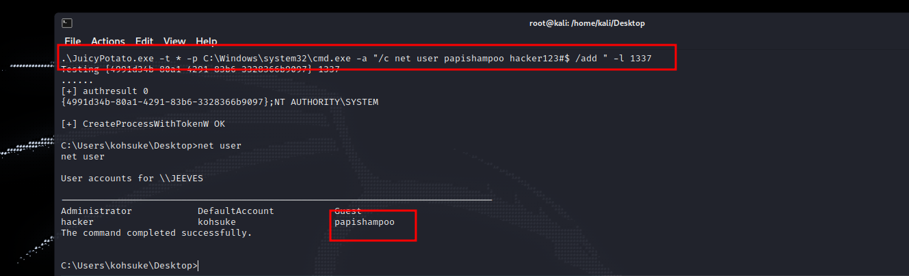

# Abusing the Golden Privileges

**Permissions: **<mark style="color:green;">**User**</mark>

<figure><figcaption></figcaption></figure>

Let's say that we have enable `SeImpersonatePrivilege` or `SeAssignPrimaryToken` privilege in the machine, we can use **juicypotato** binary to try to impersonate commands as **administrator** user, If the user has `SeImpersonate` or `SeAssignPrimaryToken` privileges then you are **SYSTEM**.



<figure><figcaption></figcaption></figure>

Here you can see how I create a user using the **juicypotato** exploit.


**Use a respective CLSID to the windows version** in case the exploit doesn't work and try again.

