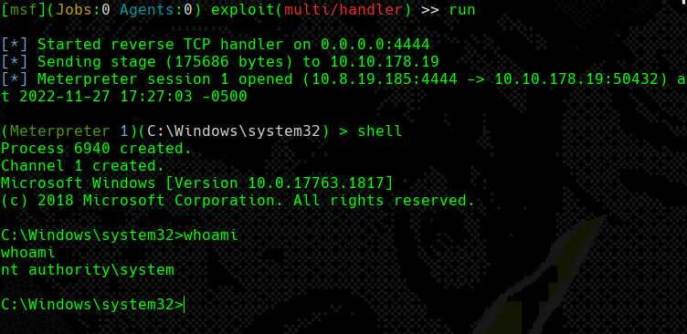

# Unquoted Path Service

**Permissions: **<mark style="color:green;">**User**</mark>

<figure><figcaption></figcaption></figure>

* In the image above you are seeing how we have a vulnerable service that is unquoted to exploit.

### Brief Explanation

* The way to exploit this vulnerability is to place a malicious executable somewhere in the service path and **name it in a way that starts with the first few letters of the next directory in the service path**. When the service starts, it will then execute the evil binary and grant remote SYSTEM access.

<figure><figcaption></figcaption></figure>

* In the following Image we see how naming our backdoor the way that starts the name of the directory that is the service we want to exploit and restarting it, we get a shell on our attaking machine.

<figure><figcaption></figcaption></figure>
