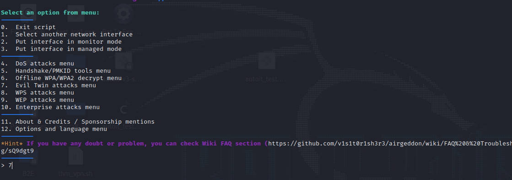
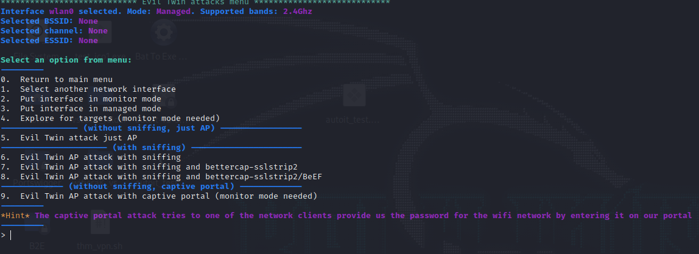
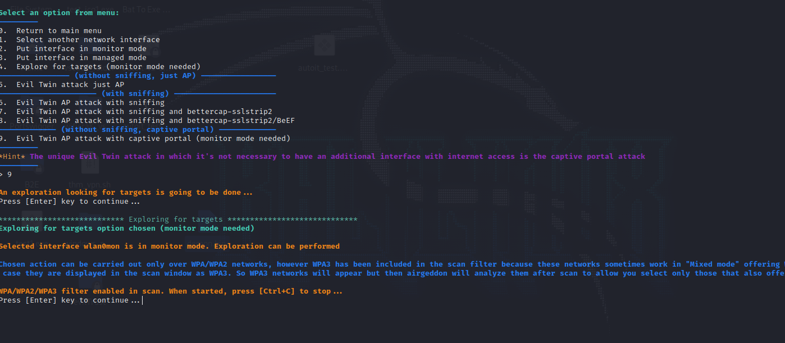
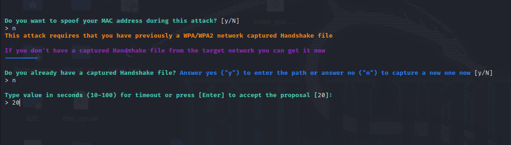
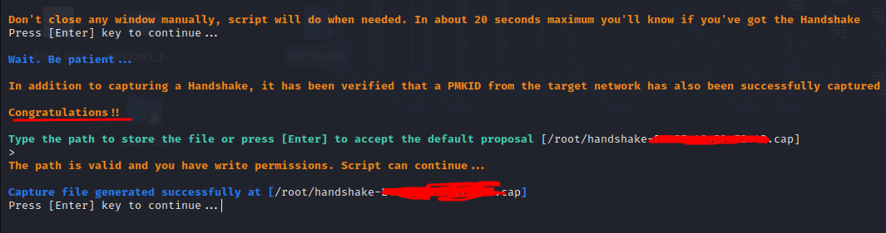
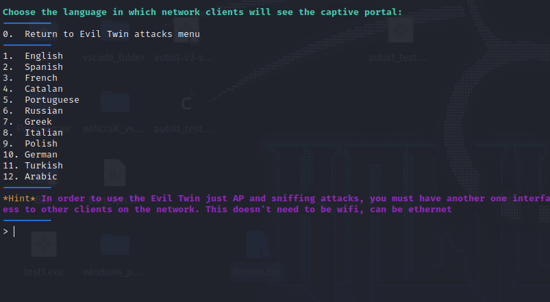
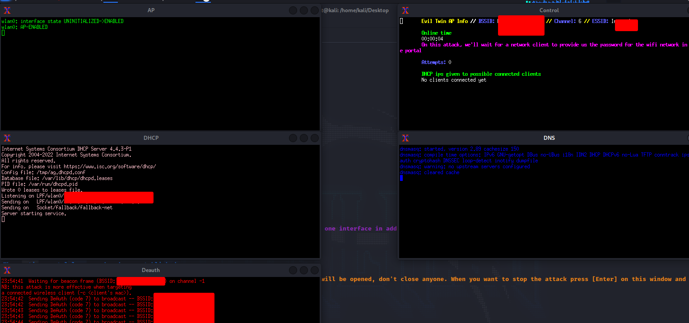
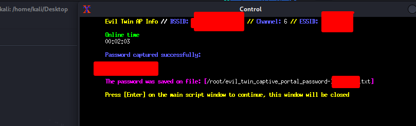

# Evil Twin Attacks

## Evil Twin Attack

* **An evil twin attack takes place when an attacker sets up a fake Wi-Fi access point hoping that users will connect to it instead of a legitimate one.**&#x20;
* When users connect to this access point, all the data they share with the network passes through a server controlled by the attacker.
* Can be used to obtain credentials about social media, Access Points and web pages that we create in order to trick the user to give us.

### Evil Twin attack (Captive Portal)

<figure><figcaption></figcaption></figure>

* In this example we are using **airgeddon**.
* Go for the option number **7**.

<figure><figcaption></figcaption></figure>

* You can select various options depending on what your **objective/expectations** are.
* In this case to make a captive portal in order to get the ap credentials, choose option number **9**.

<figure><figcaption></figcaption></figure>

* After that, the script will let you choose what ap to attack to get the **WPA handshake** and start creating the fake ap.

<figure><figcaption></figcaption></figure>

* Here I put 20 seconds to the script to get the handshake.

<figure><figcaption></figcaption></figure>

* Once You have the handshake, we can start creating our ap.

<figure><figcaption></figcaption></figure>

* Choose the language you prefer in this part.

<figure><figcaption></figcaption></figure>

* Now once we finish the ap configuration will be seen that 5 windows pops up.
* The terminal that will contain the Wi-Fi password will be that one that says Control.

<figure><figcaption></figcaption></figure>

* Here I put the password pretending to be a victim, you're seen that we get it right and fast using an Evil Twin Attack.&#x20;



### Tools to make a Evil Twin Attack




