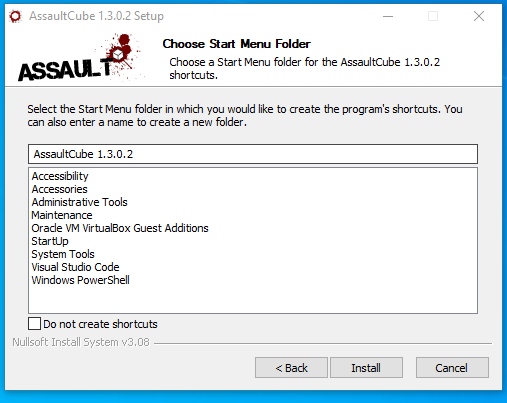

# Game Hacking


**In this Gitbook I don't exhort anybody to do illicit actions with the content provided here.**


### Concept

* Every number in game has a **variable**, there is a variable for the **health, ammo** and more. _**Where are these values and these variables stored?**_ Well, they are stored somewhere on our computer, that's what we call **memory addresses**. Here in this example, we will be changing those variable values in a game so, we can take advantage of it like, get unlimited health, ammo etc. &#x20;

To start with it, let's see what we're going to be using.

We're going to be using a game called [AssultCube](https://assault.cubers.net/) and a **Memory Scanner** called [CheatEngine](https://www.cheatengine.org/), to start our hacking demonstration.

Let's start by executing the AssultCube setup.

<figure><figcaption></figcaption></figure>

Just click **-> next -> next -> next -> next**

<figure><figcaption></figcaption></figure>

<figure><figcaption></figcaption></figure>

<figure><figcaption></figcaption></figure>

<figure><figcaption></figcaption></figure>

Once you have installed AssultCube, lets continue with the CheatEngine installation.

<figure><figcaption></figcaption></figure>

Just click:

* Next
* Skip all
* finish

Once you install CheatEngine start AssultCube and get into a map alone without anybody, to be more comfortable with the hackies.&#x20;

<figure><figcaption></figcaption></figure>

Once we enter into our solo lobby, click the monitor on the **CheatEngine** to start scanning the memory address in the program.

<figure><figcaption></figcaption></figure>

Click on **AssultCube** process.

<figure><figcaption></figcaption></figure>

First, we're going to do it's click on the **First Scan button** to have a Scan that we will be comparing with our others scan's.

In the image below, we're putting the hexadecimal value that we're looking for in our game, **it will be explained in a moment.**

<figure><figcaption></figcaption></figure>

<figure><figcaption></figcaption></figure>

In the image above we can see how I have **7 rounds** on my pistol, a pistol **maximum** round's is **10** in the pistol.

So, I need to look for memory addresses that have a value of 7 (I shotted the pistol 3 times of 10 from the **First Scan**).

Now in the image below I will be looking for memory addresses that have a value of 7.

<figure><figcaption></figcaption></figure>

I shot one bullet again, **now I have** **6 rounds** on my magazine, **let's look for those.**

<figure><figcaption></figcaption></figure>

In the image **above** we can see how shooting and looking for values lead us to the following 2 variables, one of them will be the ammo memory we're looking for.

Since they're just 2 variables we can try to guest, changing the value to see what is the ammo memory address that is using.

<figure><figcaption></figcaption></figure>

Let's select the 2 variables and added to our address list.

<figure><figcaption></figcaption></figure>

I will be changing the gun value to **9999** to see what is happens.

<figure><figcaption></figcaption></figure>


PD: I changed the value of the rifle because my game time was over so, it restarted.


There we go, I have changed the value to 9999 two times that's why the ammo it's accumulating.

<figure><figcaption></figcaption></figure>

Now to Identify the memory address of the rifle ammo, we can set a description on the **CheatEngine**.

We Can do the same with the health and other things.
