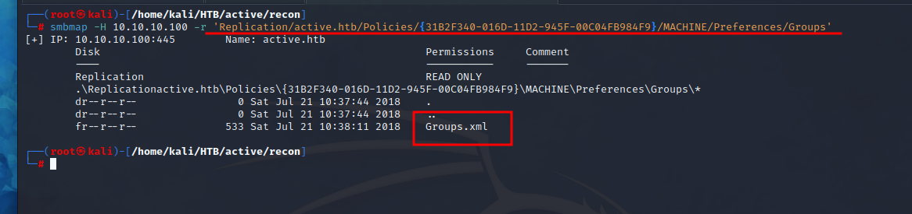
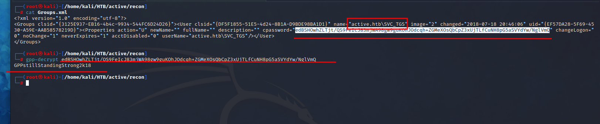
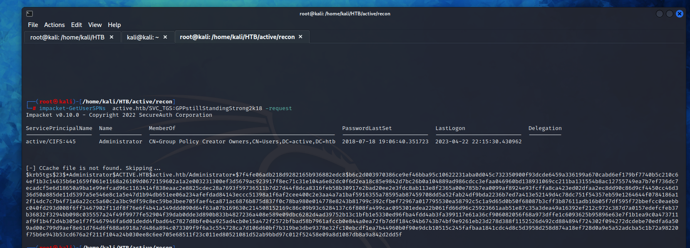
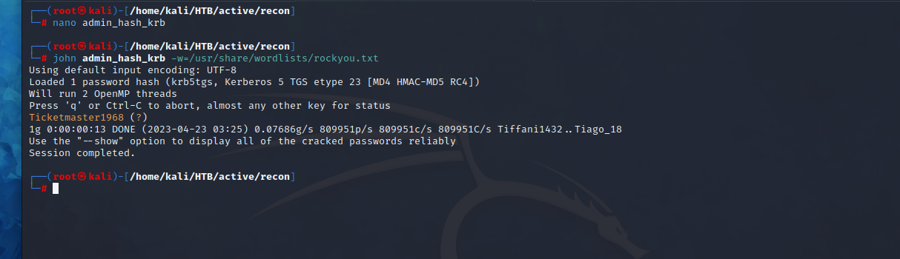
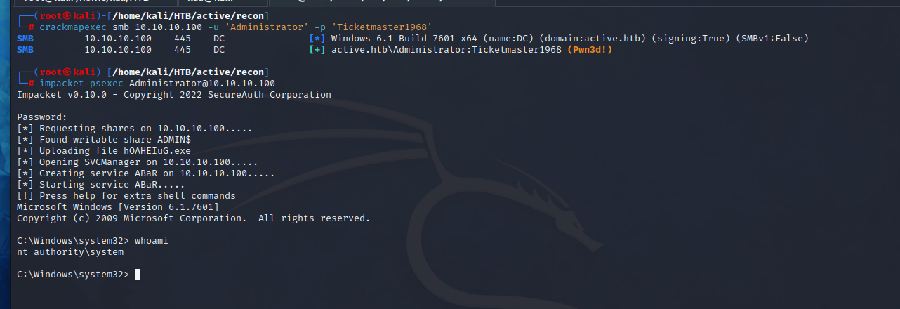

# Active

**Difficulty: **<mark style="color:green;">**EASY**</mark>

## Reconnaissance

### Nmap

```java
Nmap scan report for 10.10.10.100
Host is up (0.079s latency).

PORT      STATE SERVICE       VERSION
53/tcp    open  domain        Microsoft DNS 6.1.7601 (1DB15D39) (Windows Server 2008 R2 SP1)
| dns-nsid: 
|_  bind.version: Microsoft DNS 6.1.7601 (1DB15D39)
88/tcp    open  kerberos-sec  Microsoft Windows Kerberos (server time: 2023-04-21 01:39:19Z)
135/tcp   open  msrpc         Microsoft Windows RPC
139/tcp   open  netbios-ssn   Microsoft Windows netbios-ssn
445/tcp   open  microsoft-ds?
464/tcp   open  kpasswd5?
636/tcp   open  tcpwrapped
3268/tcp  open  ldap          Microsoft Windows Active Directory LDAP (Domain: active.htb, Site: Default-First-Site-Name)
5722/tcp  open  msrpc         Microsoft Windows RPC
49152/tcp open  msrpc         Microsoft Windows RPC
49153/tcp open  msrpc         Microsoft Windows RPC
49154/tcp open  msrpc         Microsoft Windows RPC
49155/tcp open  msrpc         Microsoft Windows RPC
49158/tcp open  msrpc         Microsoft Windows RPC
49165/tcp open  msrpc         Microsoft Windows RPC
49174/tcp open  msrpc         Microsoft Windows RPC
Service Info: Host: DC; OS: Windows; CPE: cpe:/o:microsoft:windows_server_2008:r2:sp1, cpe:/o:microsoft:windows

Host script results:
|_clock-skew: -4h58m51s
| smb2-time: 
|   date: 2023-04-21T01:40:18
|_  start_date: 2023-04-21T01:33:39
| smb2-security-mode: 
|   210: 
|_    Message signing enabled and required
```

## Exploitation

### SMB - Port 445

<figure><figcaption></figcaption></figure>

Enumerating the SMB, you'll find that the replication directory is a copy of the _SYSVOL_ folder, **what we are going to take advantage of?** we are going to take advantage of the GPP Vulnerability.

The most interesting (and dangerous) feature of GPP is the ability to set passwords for the Local Administrator account. Group Policies for account management are stored on the Domain Controller in **"Groups.xml"** files buried in the _SYSVOL_ folder.

So, download the **Groups.xml** from the route you see in the image above to decrypt the password and see a user.&#x20;

<figure><figcaption><p>gpp-decrypt</p></figcaption></figure>

Once you decrypt the password, we can try to do _ASREP-Roasting_ but, it will not work : (

### Kerberoasting

Doing a kerberoasting attack we see that the administrator user it's vulnerable.&#x20;

<figure><figcaption></figcaption></figure>

Grab the hash and start brute-forcing it with john the ripper.

<figure><figcaption></figcaption></figure>

Once you get the users password you can get inside the machine as administrator user so, you officially **pwned** the machine.

<figure><figcaption></figcaption></figure>


