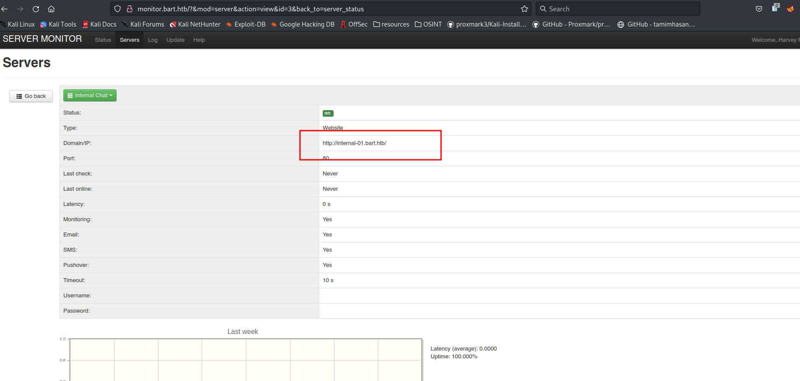
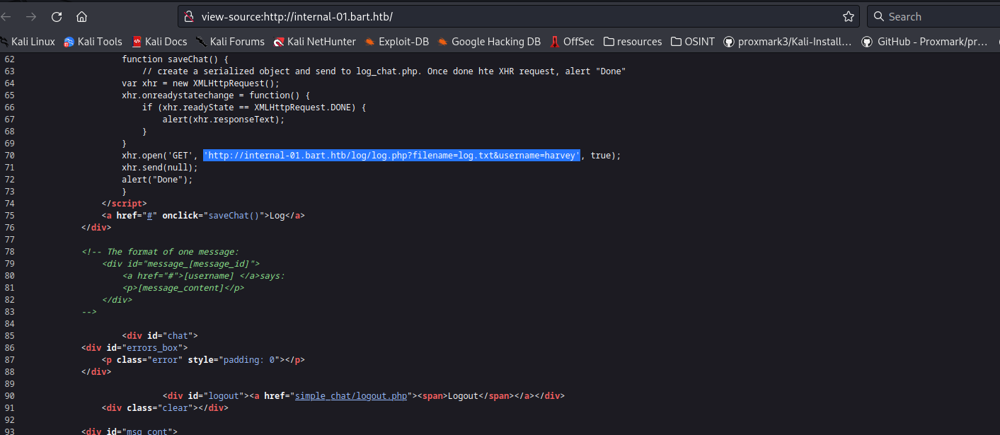

# Bart

**Difficulty: **<mark style="color:red;">**HARD**</mark>

## Reconaissance

### Nmap

```java
Nmap scan report for bart.htb (10.10.10.81)
Host is up (0.071s latency).

PORT   STATE SERVICE VERSION
80/tcp open  http    Microsoft IIS httpd 10.0
|_http-server-header: Microsoft-IIS/10.0
| http-methods: 
|_  Potentially risky methods: TRACE
|_http-title: Did not follow redirect to http://forum.bart.htb/
Service Info: OS: Windows; CPE: cpe:/o:microsoft:windows

Service detection performed. Please report any incorrect results at https://nmap.org/submit/ .
```

### HTTP - Port 80

<figure><figcaption></figcaption></figure>

Trying to load the page we see that we cannot resolve the address why? because we don't have it in the **/etc/hosts** file.

<figure><figcaption></figcaption></figure>

So, once we pass the domain and subdomains to the **/etc/hosts**, let's start enumerating the page.

<figure><figcaption></figcaption></figure>

There is nothing too much interesting but, we have some emails, users and names that can be useful.&#x20;

<figure><figcaption></figcaption></figure>

I just put it all in a file and continue making recon on the machine.

<figure><figcaption></figcaption></figure>

Using **ffuf** to **brute-force** for subdomains we can see that there is a subdomain called monitor.

<figure><figcaption></figcaption></figure>

We see this login page, we can try to validate users that we found in the previous page, before start **bruteforcing** the login with any other users let's try a little of password guessing.

<figure><figcaption></figcaption></figure>

Using the user _**harvey**_, and passing the password _**potter (his last name)**_ we get access to his account.

<figure><figcaption></figcaption></figure>

Once you get in you can see that there's another subdomain inside of it so, pass it to the **/etc/hosts**.

<figure><figcaption></figcaption></figure>

In the **internal-01** subdomain we can see this login page, you can try to do a _SQL Injection_ but, in the URL, we can see and pretend that we are in front of an open-source project so, you can look up for it on google to see if there is any coincidence.

<figure><figcaption></figcaption></figure>

You can see that there is a project that is similar to our URL path/directories.

<figure><figcaption></figcaption></figure>

Analyzing the code, you can register a user by doing a **POST** request with the parameters **`uname`** and **`passwd`** and pointing to the **register.php**, you can try to register a new user with **cURL**.

<figure><figcaption></figcaption></figure>

Run the command with **cURL** and try to get in with the created user.

<figure><figcaption></figcaption></figure>

<figure><figcaption></figcaption></figure>

So, we get in successfuly, now let's continue making recon.

<figure><figcaption></figcaption></figure>

Viewing the source code on the page we see that there is a strange URL path so, let's play with it.

## Exploitation

### Log Poisoning

<figure><figcaption></figcaption></figure>

We get a number one, we can pretend that is because the user is valid.

<figure><figcaption></figcaption></figure>

Ok, here we're getting a 0 because the user is not valid on the machine, looking a little the URL we can see the directories that are called log, we can try to see if we can make a log using the name of _**harvey**_ and try to open it.

<figure><figcaption></figcaption></figure>

<figure><figcaption></figcaption></figure>

Now knowing that using a valid user we can create a log and displayed let's see if we can do it with other file format like **php** so, we can upload our web shell and the reverse shell to get access.

<figure><figcaption></figcaption></figure>

Perfect, now I will use **python3** to create the request and continue to poison the logs using the _`User-agent`_.

<figure><figcaption></figcaption></figure>

You can see there that by passing php code on the User-agent parameter and changing the file format that we want in this case php we can upload a web shell.&#x20;

<figure><figcaption></figcaption></figure>

Now once we can execute commands using our web shell, let's continue to upload and execute our reverse shell using **nishang powershell** script and listening with a **netcat** session with **rlwrap**.&#x20;

## Privilege Escalation

<figure><figcaption></figcaption></figure>

Enumerating our way to get admin privileges, we can see that the **SeImpersonatePrivilege** is enable in this machine, let's continue to upload the **JuicyPotato** program to exploit it.

<figure><figcaption></figcaption></figure>

Remember to use the correct **CLSID** for the machine to exploit this correctly.

<figure><figcaption></figcaption></figure>

Now, why I am uploading a **netcat** binary to the windows machine? Well, it is to get a shell more easily once we execute the command as administrator.

<figure><figcaption></figcaption></figure>

We Perfectly get in as the administrator user.

<figure><figcaption></figcaption></figure>

You can see the flag on the admin desktop directory.

## Persistence

<figure><figcaption></figcaption></figure>

Now let's say that we as an attacker want to get a persistence on the windows machine, to keep it simple what I'm doing is opening the port **445** to **outside** and **inside** but, for what? We will create a user with administrative privileges, and we will be able to get in with that user using **psexec.py**.

<figure><figcaption></figcaption></figure>

<figure><figcaption></figcaption></figure>

I will use crackmeapexec to dump the **SAM** to further attacks like pass the hash using xfreerdp, if we was on a active directory enviorment we want to dump the password policy too so let's do it too.

<figure><figcaption></figcaption></figure>

<figure><figcaption></figcaption></figure>

We perfectly get the info we want by using our persistent user.

<figure><figcaption></figcaption></figure>

The other way we can dump the SAM of windows is by using the windows registry, we can see it in the image above.

<figure><figcaption></figcaption></figure>

Now, finally using a samba server we can download it.
