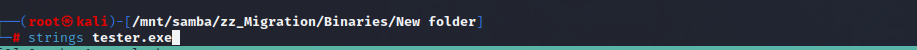
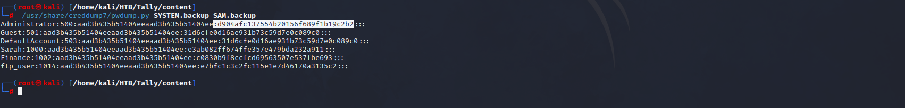

# Tally

**Difficulty: **<mark style="color:red;">**HARD**</mark>

## Reconnaissance

### Nmap

```java
Nmap scan report for 10.10.10.59
Host is up (0.20s latency).

PORT      STATE SERVICE       VERSION
21/tcp    open  ftp           Microsoft ftpd
| ftp-syst: 
|_  SYST: Windows_NT
80/tcp    open  http          Microsoft HTTPAPI httpd 2.0 (SSDP/UPnP)
| http-title: Home
|_Requested resource was http://10.10.10.59/_layouts/15/start.aspx#/default.aspx
|_http-server-header: Microsoft-IIS/10.0
|_http-generator: Microsoft SharePoint
81/tcp    open  http          Microsoft HTTPAPI httpd 2.0 (SSDP/UPnP)
|_http-title: Bad Request
|_http-server-header: Microsoft-HTTPAPI/2.0
135/tcp   open  msrpc         Microsoft Windows RPC
139/tcp   open  netbios-ssn   Microsoft Windows netbios-ssn
445/tcp   open  microsoft-ds  Microsoft Windows Server 2008 R2 - 2012 microsoft-ds
808/tcp   open  ccproxy-http?
1433/tcp  open  ms-sql-s      Microsoft SQL Server 2016 13.00.1601.00; RTM
| ms-sql-info: 
|   10.10.10.59:1433: 
|     Version: 
|       name: Microsoft SQL Server 2016 RTM
|       number: 13.00.1601.00
|       Product: Microsoft SQL Server 2016
|       Service pack level: RTM
|       Post-SP patches applied: false
|_    TCP port: 1433
|_ssl-date: 2023-04-16T01:25:36+00:00; -4h58m17s from scanner time.
| ms-sql-ntlm-info: 
|   10.10.10.59:1433: 
|     Target_Name: TALLY
|     NetBIOS_Domain_Name: TALLY
|     NetBIOS_Computer_Name: TALLY
|     DNS_Domain_Name: TALLY
|     DNS_Computer_Name: TALLY
|_    Product_Version: 10.0.14393
| ssl-cert: Subject: commonName=SSL_Self_Signed_Fallback
| Not valid before: 2023-04-15T16:06:56
|_Not valid after:  2053-04-15T16:06:56
32843/tcp open  http          Microsoft HTTPAPI httpd 2.0 (SSDP/UPnP)
|_http-server-header: Microsoft-HTTPAPI/2.0
|_http-title: Service Unavailable
47001/tcp open  http          Microsoft HTTPAPI httpd 2.0 (SSDP/UPnP)
|_http-title: Not Found
|_http-server-header: Microsoft-HTTPAPI/2.0
49666/tcp open  msrpc         Microsoft Windows RPC
49668/tcp open  msrpc         Microsoft Windows RPC
49671/tcp open  msrpc         Microsoft Windows RPC
Service Info: OSs: Windows, Windows Server 2008 R2 - 2012; CPE: cpe:/o:microsoft:windows

Host script results:
| smb-security-mode: 
|   authentication_level: user
|   challenge_response: supported
|_  message_signing: disabled (dangerous, but default)
| smb2-security-mode: 
|   311: 
|_    Message signing enabled but not required
| smb2-time: 
|   date: 2023-04-16T01:25:26
|_  start_date: 2023-04-15T16:06:34
|_clock-skew: mean: -4h58m17s, deviation: 0s, median: -4h58m17s

```

### HTTP - Port 80

<figure><figcaption></figcaption></figure>

Starting with the **HTTP** enumeration we found out that this is a _Microsoft IIS_ and is servicing a **Microsoft-SharePoint**.

<figure><figcaption></figcaption></figure>

To be stealthy and not so aggressive I will look for juicy directories using a Pentest report from internet.

<figure><figcaption></figcaption></figure>

Here we can see potential directories that can give us access to some features of the Microsoft SharePoint so, let's start enumerating them.

<figure><figcaption></figcaption></figure>

I see 2 directories with 1 item each one of them. Let's download what it's inside to analyze it.&#x20;

<figure><figcaption></figcaption></figure>

The server is making some filters to don't let us get in, just erase the **URL** as showed in the image.&#x20;

<figure><figcaption></figcaption></figure>

Inside the FinanceTeam file we can see a username to use on the ftp server.&#x20;

<figure><figcaption></figcaption></figure>

On the other hand, we have the _**ftp\_details.docx**_.

<figure><figcaption></figcaption></figure>

Opening the file with LibreOffice we can see that this file has the password of the previous user that we get.

### FTP - Port 21

<figure><figcaption></figcaption></figure>

Looking if I could connect using the username _**anonymous**_ without password, we find out that this service is protected with a user and password that we don't know.

Using the given credentials that we find out on those files we can log into the ftp server.

We will be using _**curlftpfs**_ to mount the ftp server and enumerate all the files more easily.

<figure><figcaption></figcaption></figure>

Using the ftp mount that we have made, I will use tree to enumerate all the directories and files that are on each directory.

<figure><figcaption></figcaption></figure>

Here we can see an interesting **keepass** database in the showed image so let's continue to crack it using _JohnTheRipper_.

<figure><figcaption></figcaption></figure>

Here we see the password of this database, just open the database with **keepasskc** and use the cracked password.

<figure><figcaption></figcaption></figure>

Inside the database we found a user and its password we can use these credentials in the smb server, let's continue enumerating it.

### SMB - Port 445

First let's check the user and password we get from keepass db.

<figure><figcaption></figcaption></figure>

Using the **keepass** credentials let's continue to make a **cifs** mount for the **smb server** and enumerate it with a tree command.

<figure><figcaption></figcaption></figure>

<figure><figcaption></figcaption></figure>

<figure><figcaption></figcaption></figure>

I found an interesting directory called **Binaries** so, looking those we can see that there is a `tester.exe` so, let's try to use strings first, in case we don't see anything we use another thechniques to reverse the code an see what this is.

<figure><figcaption></figcaption></figure>

<figure><figcaption></figcaption></figure>

Using strings, we can see that there are some credentials for the **MS-SQL** service.

Once you get this credentials let's start exploiting the **MS-SQL** service.

## Exploitation

<figure><figcaption></figcaption></figure>

Once we get in, try to execute a command on the machine using the **xp\_cmdshell** command.

<figure><figcaption></figcaption></figure>

We need to activate the xp\_cmdshell command and reconfigure the database for changes.


```java
sp_configure "show advaced options",1 # activate the advanced options on the database
reconfigure
sp_configure "xp_cmdshell",1 # enable the command 
reconfigure
xp_cmdshell "whoami" # execute a system comm
```


Now, I will use nishang powershell backdoor to gain access in the followin images will be shown.

<figure><figcaption><p>Http Nishang Backdoor </p></figcaption></figure>

<figure><figcaption><p>One-liner to get the backdoor executed</p></figcaption></figure>

<figure><figcaption></figcaption></figure>

Yay, once we get access let's continue enumerating the system, we will see very fast that we can abuse the golden privileges using juicy potato.

## Privilege Escalation

To know how to exploit these privileges click in the following page link.&#x20;


[abusing-the-golden-privileges.md](../../../../everything-about-and-notes/windows-and-active-directory/windows-privilege-escalation/abusing-the-golden-privileges.md)


<figure><figcaption></figcaption></figure>

Now we get Admin privileges : )

## Persistence

<figure><figcaption></figcaption></figure>

Cotinuing with making a persistence let's get the SAM and the SYSTEM files so, we can get the users hashes and make pass the hash in order to obtain a shell again in the machine.

<figure><figcaption><p>downloading file to our machine</p></figcaption></figure>

<figure><figcaption><p>pwdump</p></figcaption></figure>

Using pwdump get the users hashes to get a shell as that user in the future.

<figure><figcaption><p>Pass the hash</p></figcaption></figure>

Here we can see how we get a persistence just dumping the **SAM,** **SYSTEM** files and get the users hashes to obtain a shell.
