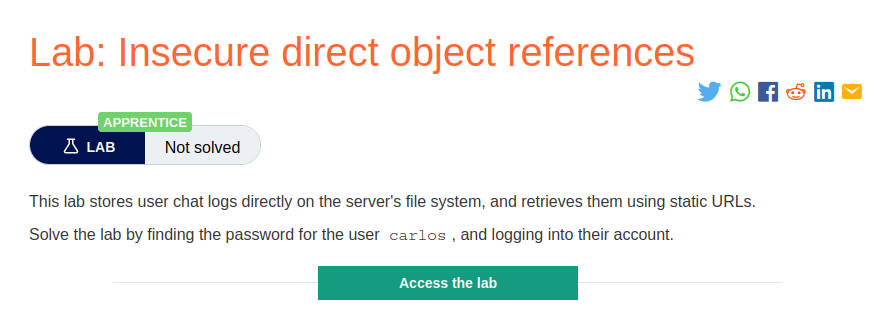
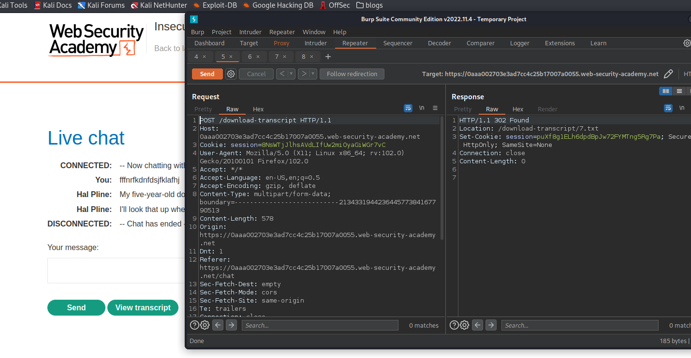
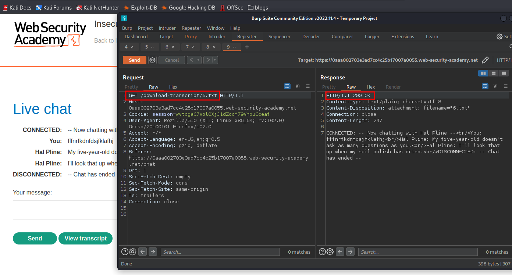
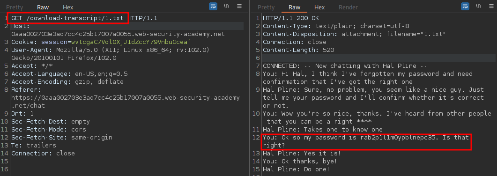
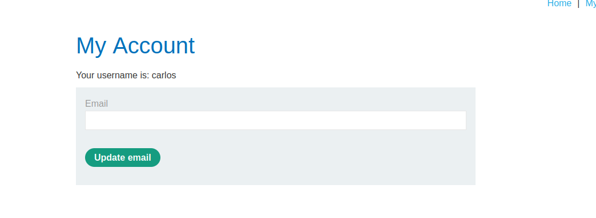

# Insecure Direct Object References (IDOR)

**Level:** <mark style="color:green;">**Apprentice**</mark>

<figure><figcaption></figcaption></figure>

### What's an IDOR?

* Insecure direct object references (**IDOR**) **are a subcategory of access control vulnerabilities.**
* **IDOR** arises when an application uses user-supplied input to access objects directly and an attacker can modify the input to obtain unauthorized access.

<figure><figcaption></figcaption></figure>

* Here we have a live chat, and we can click on the function transcript to download our conversation
* Intercepting the request, you'll see a **302-status code**_, just follow the redirection._

<figure><figcaption></figcaption></figure>

* We see that we are downloading a file called `6.txt.`
* Let's try to access other conversations by changing our `6.txt` to `1.txt.`

<figure><figcaption></figcaption></figure>

* When we change the number, we can _'accidentally'_ get another transcript.
* In the `1.txt` is filtering the Carlos conversation to recover the password, so copied and log in.

<figure><figcaption></figcaption></figure>
