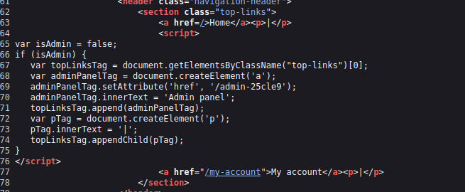
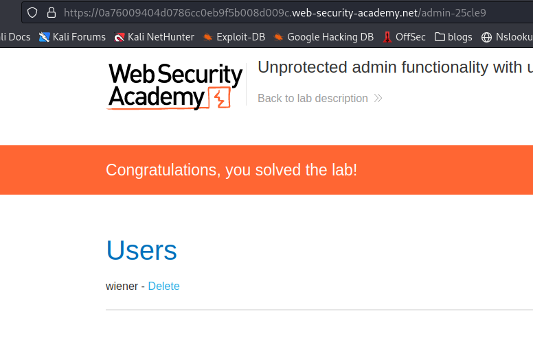

# Unprotected admin functionality with unpredictable URL

**Level:** <mark style="color:green;">**Apprentice**</mark>

<figure><figcaption></figcaption></figure>

* Here in this lab, we need to find the hidden location of a directory **that is somewhere on the webpage**, with some recon of the page we can see the admins hidden directory.

<figure><figcaption>
HTML-Recon
</figcaption></figure>

* We will see that there is JavaScript code in the main page, here is declaring a variable and if that variable is equal to true, we will see an **"Admin Panel"** that will send you to a directory called "**/admin-25cle9".**
* **Let's take a look to the hidden admin directory.**

<figure><figcaption>
Admin Panel via access control
</figcaption></figure>

Finally, we get inside the admin panel and delete the user **Carlos**.
