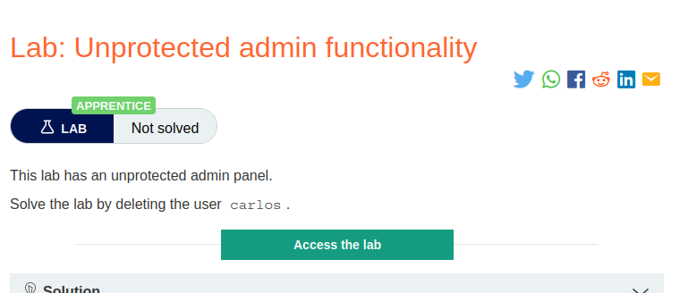
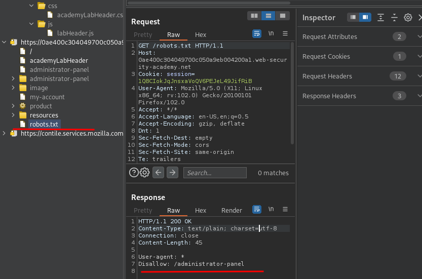
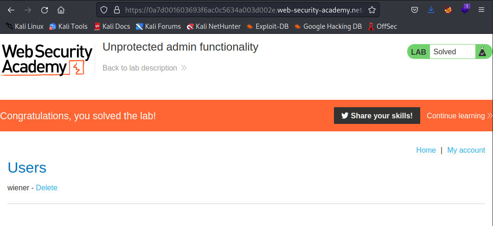

# Unprotected admin functionality

**Level:** <mark style="color:green;">**Apprentice**</mark>

<figure><figcaption>
Level 1
</figcaption></figure>

* To pass the level we need to understand what an access control vulnerability is. In this level specifically we need to find a way to **access to an admin function that** **we not supposed to interact with it.**
* Even if the URL isn't disclosed anywhere, **an attacker may be able to use a wordlist to brute-force** the location of the sensitive functionality.
* At its most basic, vertical privilege escalation arises where an application does not enforce any **protection over sensitive functionality** like we have seen below.
* This might in fact be accessible by **any user, not only administrative users** who have a link to the functionality in their user interface.

<figure><figcaption></figcaption></figure>

Enumerating with **Burp Suite** we can see that we can access to the **robots.txt,** and with it we have a juicy directory, if we enter to it, **we can interact with the admin panel as seen below:**

<figure><figcaption></figcaption></figure>
