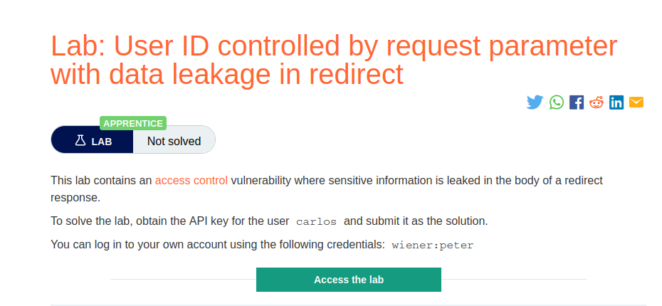
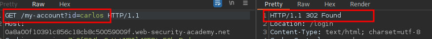
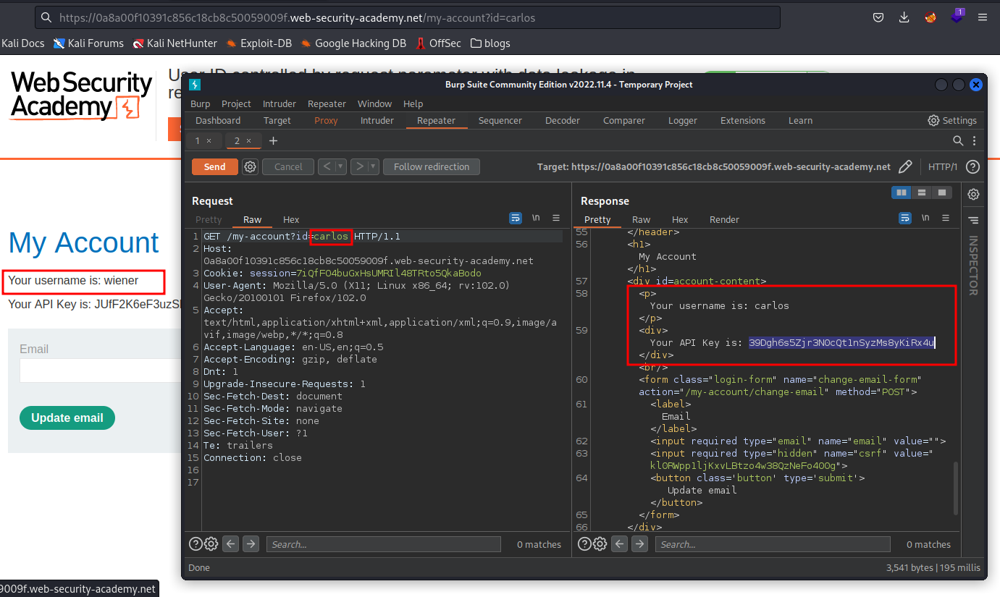

# User ID controlled by request parameter with data leakage in redirect

**Level:** <mark style="color:green;">**Apprentice**</mark>

<figure><figcaption></figcaption></figure>

* In this lab we continue playing with the id parameter on my account page
* Start making some recon with Burp Suite and found this.

<figure><figcaption></figcaption></figure>

* **302 status code** from the server, basically in this case is for **redirecting** us to another page, that is `/login.`
* Take a look at the response of the **302-server response**, you will see that is letting us to see the user's password.&#x20;

<figure><figcaption></figcaption></figure>

* There is the **API Key** **from the user Carlos.**
* Remember Do your homework by making recon on the features, functions, parameters and stuff on the page.
