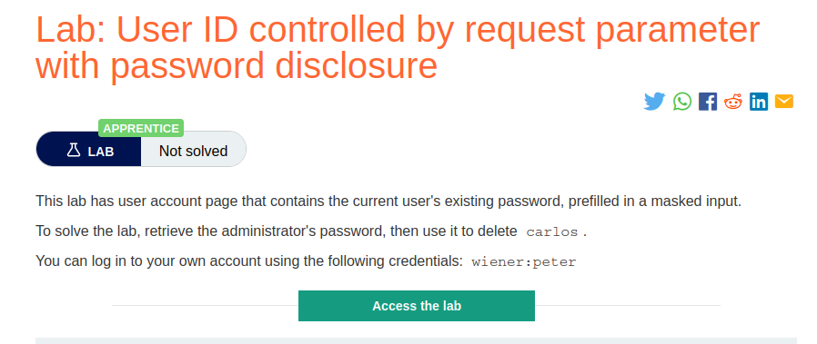
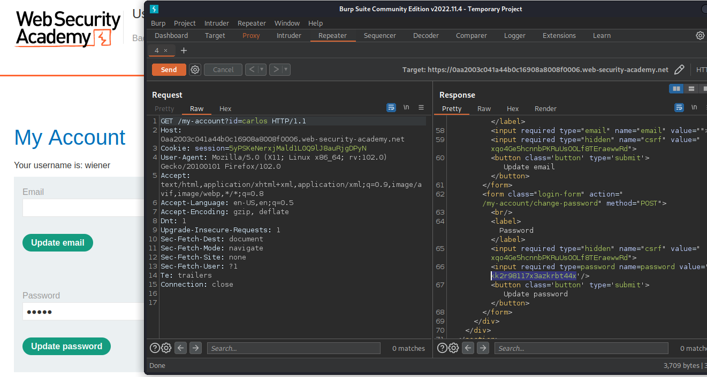
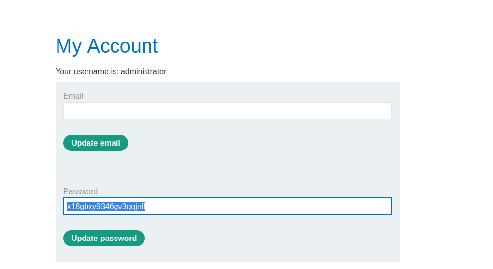

# User ID controlled by request parameter with password disclosure

**Level:** <mark style="color:green;">**Apprentice**</mark>

<figure><figcaption></figcaption></figure>

* We need to retrieve a password like literally all the access control series.
* If you complete the past labs, this lab is like the last we do.

<figure><figcaption></figcaption></figure>

* Just change the **id** parameter to administrator or Carlos.
* This time the in the response is filtering the password.
* Log in as the user Administrator and complete the lab.

<figure><figcaption></figcaption></figure>
