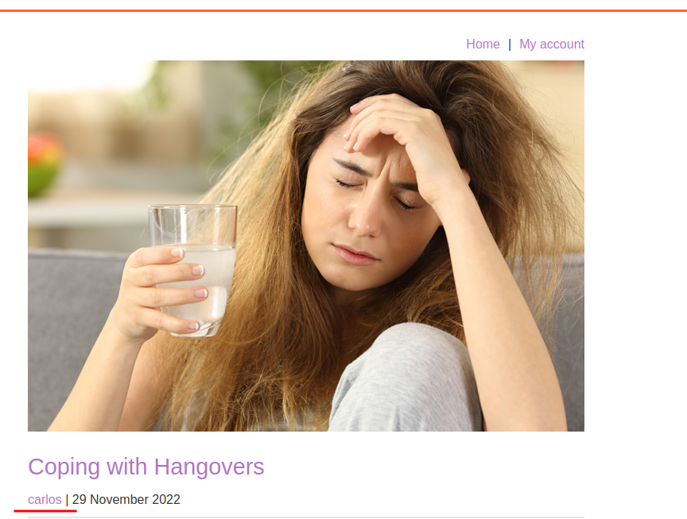
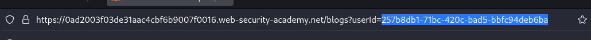
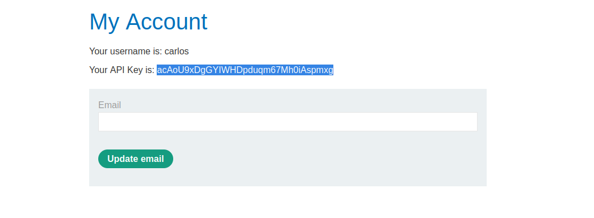

# User ID controlled by request parameter, with unpredictable user IDs

**Level:** <mark style="color:green;">**Apprentice**</mark>

<figure><figcaption></figcaption></figure>

* In this lab we need to get access to the API Key of Carlos again.
* If you try to get access to another user account by changing the id parameter to Carlos, we will not see anything interesting
* Now the users have an identifier random number.

<figure><figcaption></figcaption></figure>

* Making some recon on the posts in the page, you will see that you can see another user id random number by clicking on a posts of the respective user

<figure><figcaption></figcaption></figure>

* Try to copy the `userid` from one of the posts from user Carlos.
* Paste the user id from the post into your `my-account` userid and you will that we're log into the account of carlos to complete the lab.

<figure><figcaption></figcaption></figure>
