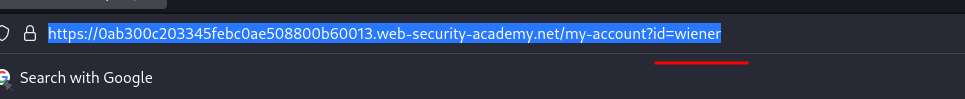

# User ID controlled by request parameter

**Level:** <mark style="color:green;">**Apprentice**</mark>

<figure><figcaption></figcaption></figure>

* In this lab we need to obtain the API key of the user Carlos by making a horizontal priviledge escalation.

<figure><figcaption></figcaption></figure>

* Here in the users `my-account`we see that we have an API Key&#x20;
* We have a email form, so I intercepted with burpsuite to make some recon on it.

<figure><figcaption></figcaption></figure>

* There is nothing interesting in the requests that we are making to change our email.

<figure><figcaption></figcaption></figure>

* In the **URL** we can see that there is an **id parameter** that identifies a user.
* So, we can try to exploit this changing the username.

<figure><figcaption></figcaption></figure>

* Now we are in the carlos user account by changing the user id to Carlos username, finally complete the challenge.
