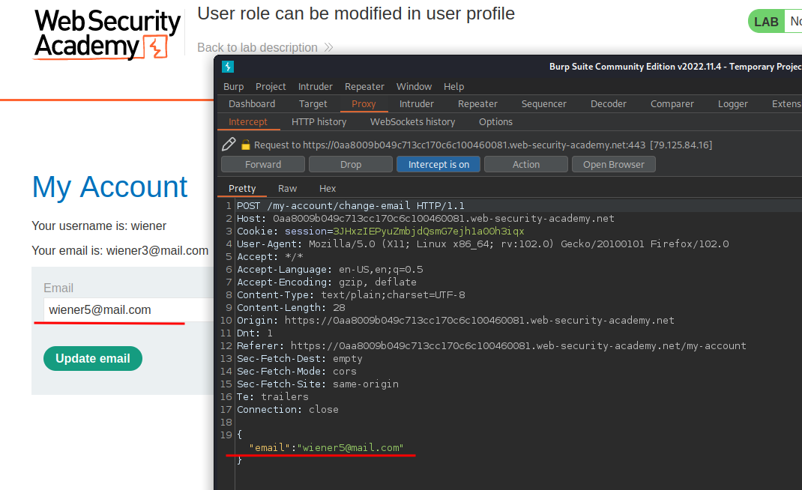
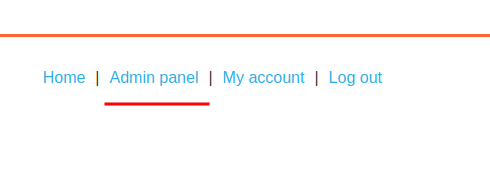

# User role can be modified in user profile

**Level:** <mark style="color:green;">**Apprentice**</mark>

<figure><figcaption></figcaption></figure>

* The following challenge tells us to log in and delete user Carlos.
* We will do that using the `roleid` parameter in the modified requests.

<figure><figcaption></figcaption></figure>

* Making some recon, you will notice that the requests we are making to change the user email is in **JSON format**
* We can try to add the `roleid` parameter with the value of 2 as said in the beginning.

<figure><figcaption></figcaption></figure>

* add the `roleid` this way

<figure><figcaption></figcaption></figure>

* Once you make the modified requests you will see that we can access an **"admin feature"**.
* Click on it to delete user Carlos and Complete the challenge.
