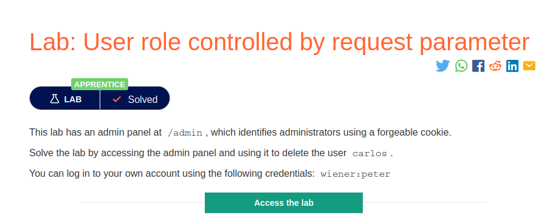
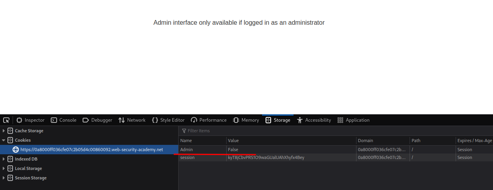
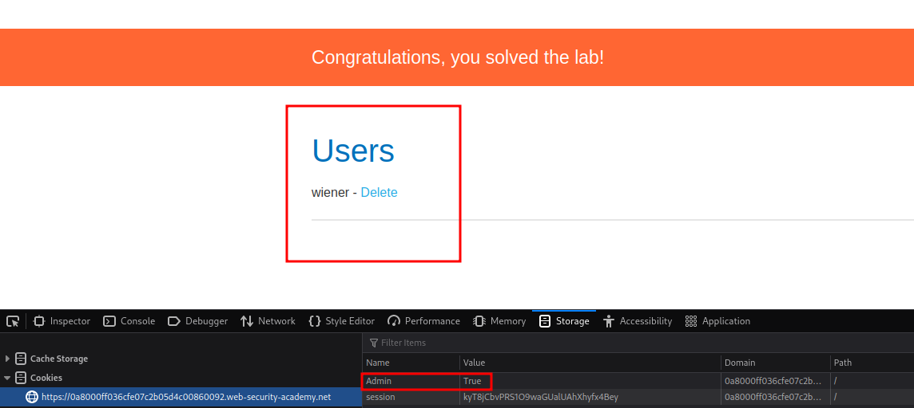

# User role controlled by request parameter

**Level:** <mark style="color:green;">**Apprentice**</mark>

<figure><figcaption></figcaption></figure>

* Now we need to get in some way into administrative panel but this time we will be exploiting a forgeable cookie.

<figure><figcaption>
admin directory
</figcaption></figure>

* Looking at the **/admin** directory and my **cookies**, we see that there is a cookie called Admin, and it has the value of **False.**
* What happens if we change the admin cookie to true and try to access admins directory.

<figure><figcaption></figcaption></figure>

Voila! we magically access the **/admin** directory and delete user Carlos.
