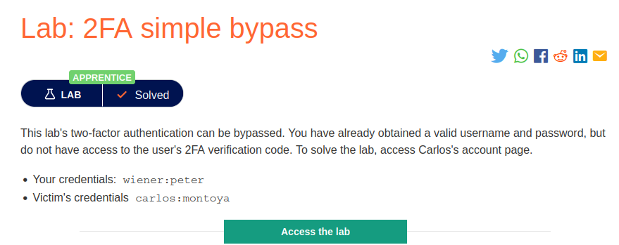
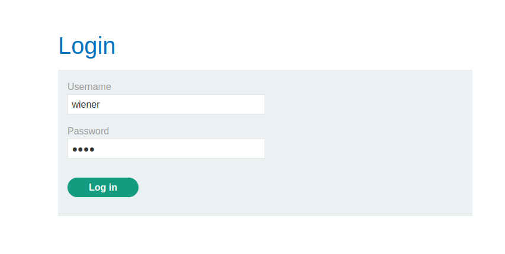
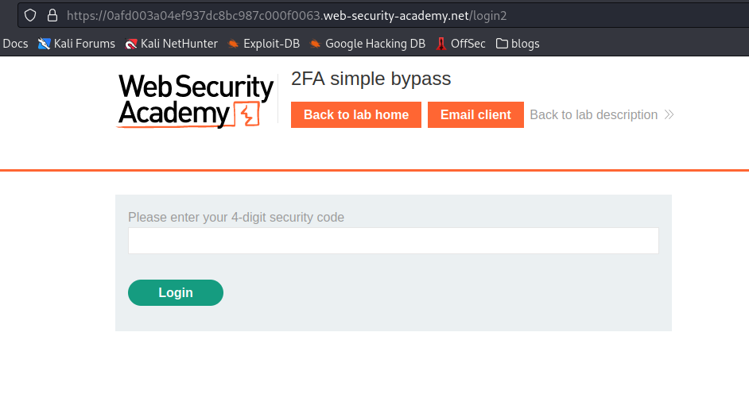
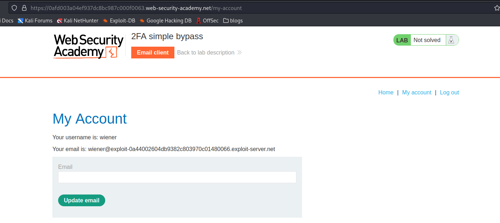
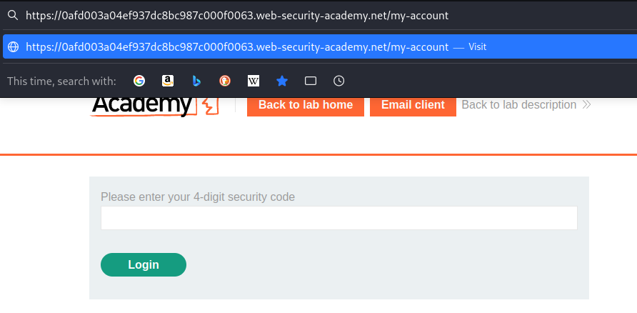
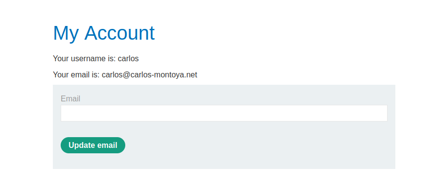

# 2FA simple bypass

**Level:** <mark style="color:green;">**Apprentice**</mark>

<figure><figcaption></figcaption></figure>

* This is just a simple 2FA Bypass, that it.
* First, start authenticating to see what we can do with it.

<figure><figcaption></figcaption></figure>

* Okay once we put the password and username, it tells us that an email has been sent to the respective user email.

<figure><figcaption></figcaption></figure>

* Just to see what I can modify I put the 4-digit pin into it.
* Nothing interesting for now.

<figure><figcaption></figcaption></figure>

* Knowing that is a _**simple 2FA Bypass**_, I've seen that once you log in with the user credentials there is a `/login2`
* So, try to change it to `/my-account` or `/login1` to see what can happen.

<figure><figcaption></figcaption></figure>

* Just getting out the `/login2` you get into the user account, that's how simple it is.

<figure><figcaption>
work done
</figcaption></figure>
