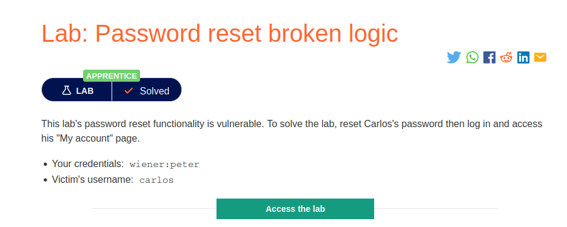
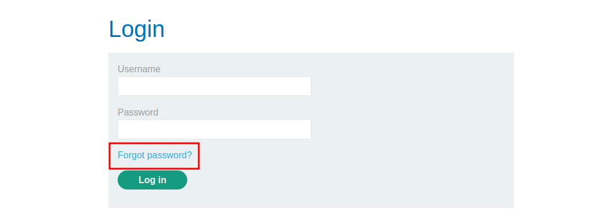
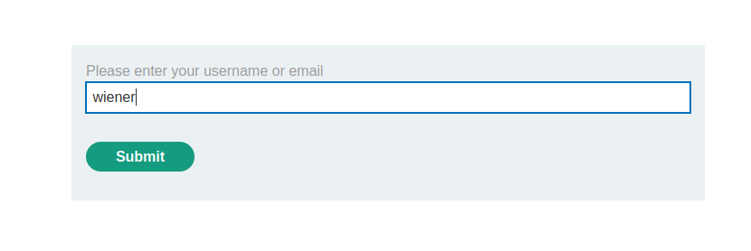
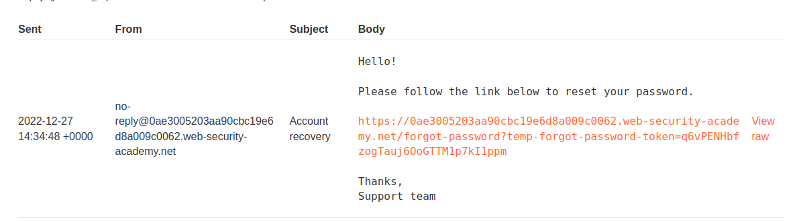
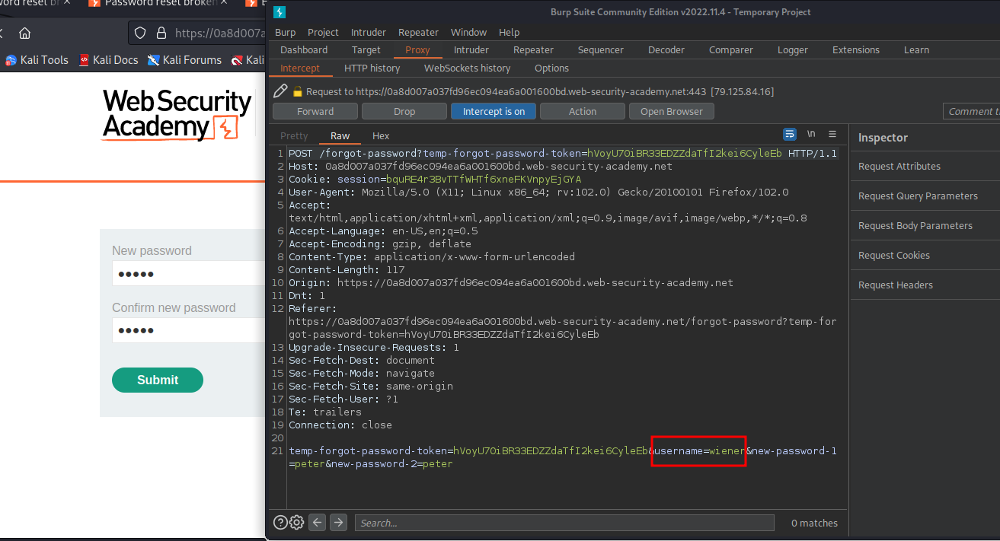
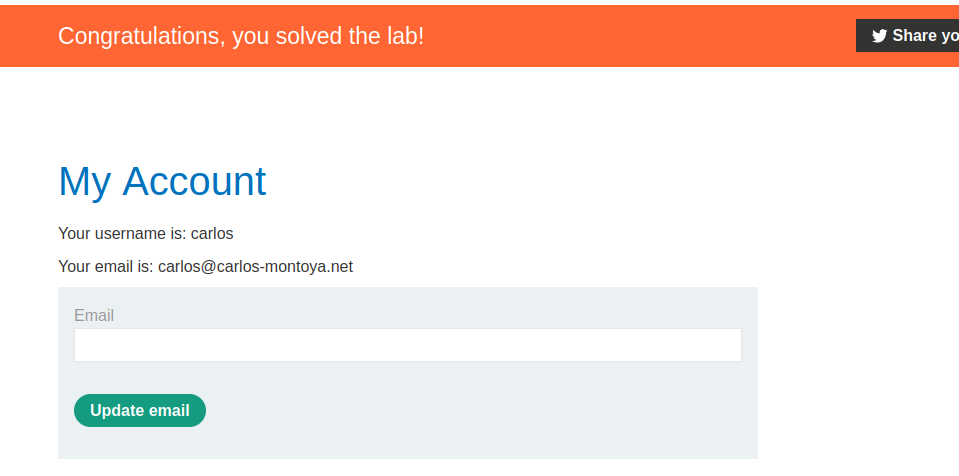

# Password reset broken logic

**Level:** <mark style="color:green;">**Apprentice**</mark>

<figure><figcaption></figcaption></figure>

* The following lab basically says Reset another's user password.
* So, go straight to it.

<figure><figcaption></figcaption></figure>

* Click on the Forgot Password

<figure><figcaption></figcaption></figure>

* I made the common process of resetting the password for my account
* Start to intercept literally every request to make some recon.

<figure><figcaption></figcaption></figure>

* Finally, I get Something Interesting in the parameters and info we are passing once we put our new password.

<figure><figcaption></figcaption></figure>

* There is a username parameter that if we change it to user Carlos, we can change his password using my respective new password form.

<figure><figcaption></figcaption></figure>
