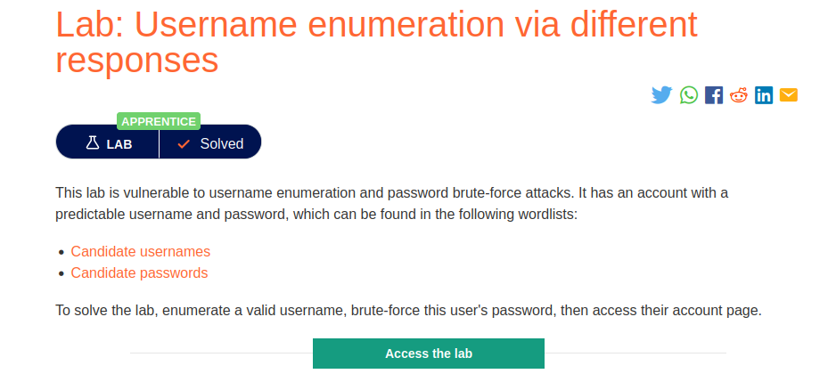
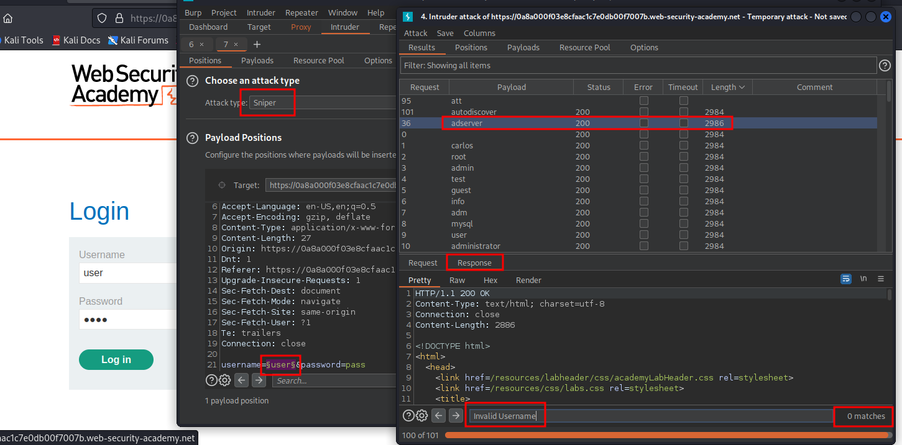
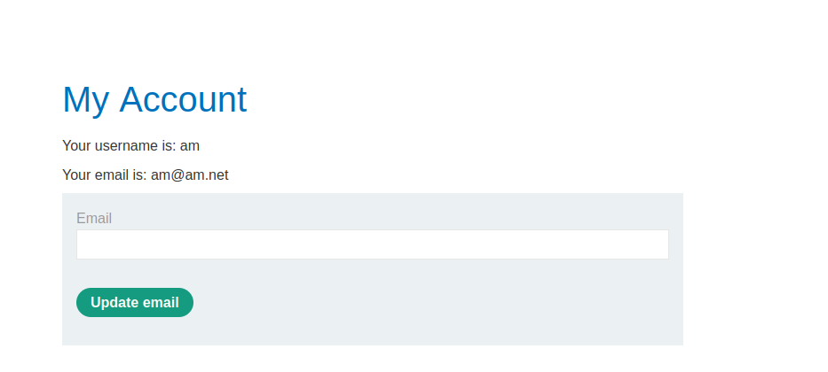

# Username enumeration via different responses

**Level:** <mark style="color:green;">**Apprentice**</mark>

<figure><figcaption></figcaption></figure>

* The lab provided here has a potential way to _**enumerate users**_ on the `my-account` form.
* I will be playing this time with **Burp Suite** to make it "faster" and easy.
* Download the 2 wordlists presented on the page

<figure><figcaption>
Burp Suite User Enumeration
</figcaption></figure>

* Let's use the intruder for this, to make a _**sniper attack**_ and use a **simple list** to enumerate the users first.
* As you see in the burp suite example, I filter by the length of the response.
* Later that, I search for the keyword `Invalid username.`
* Same process to know the password

<figure><figcaption></figcaption></figure>

* Once you get credentials login as the valid user and its respective password.
