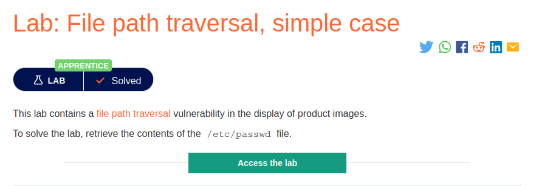
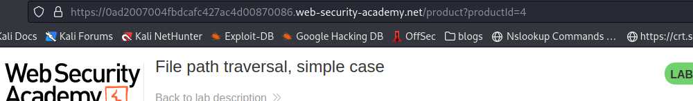
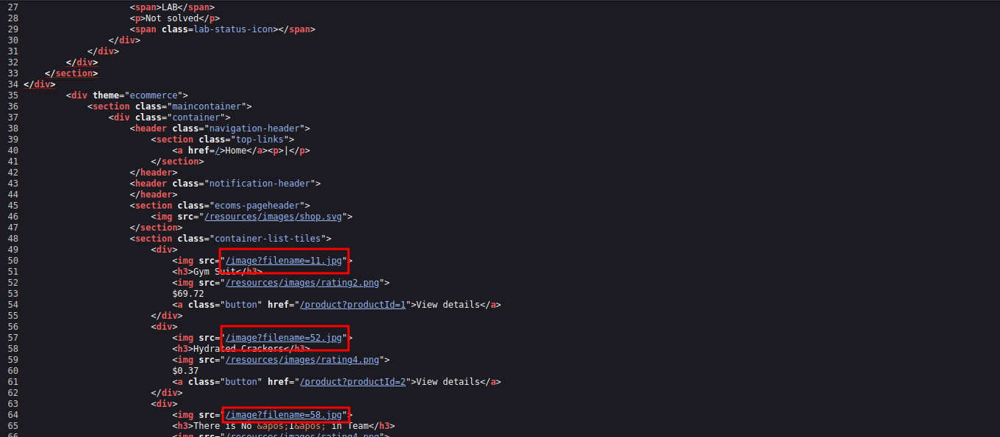
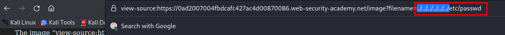

# File path traversal, simple case

**Level:** <mark style="color:green;">**Apprentice**</mark>

<figure><figcaption></figcaption></figure>

* In this lab we're going to be making the most basic's directory path traversal.
* Where do I look for this vulnerability? You can look for this vulnerability in parameters that are getting a file from an application route.

<figure><figcaption></figcaption></figure>

* In the parameter `productId` we will not find anything. Why? The parameter it's been used to indicate the number of a blog post, for example in a **DB**.
* Looking through the html source code, we see that the is a filename and pointing to an image.
* We can make it pointer to the file we want for example ( /etc/passwd, /var/log/apache2/apache2.log . etc. )

<figure><figcaption></figcaption></figure>

* As it is a Directory Path traversal, we put the `../../../../../../` to get backwards on the system.

<figure><figcaption></figcaption></figure>

