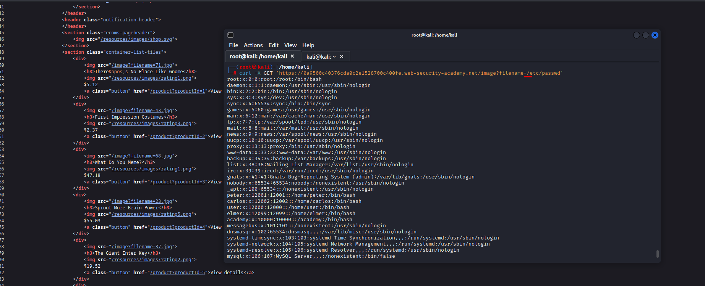

# File path traversal, traversal sequences blocked with absolute path bypass

**Level:** <mark style="color:blue;">**Practitioner**</mark>

<figure><figcaption></figcaption></figure>

* In this challenge, just the sequences like `../../../../` or other are blocked.

<figure><figcaption></figcaption></figure>

* Try with just passing **"from the root path, open passwd"**
* Just use **/** and if its not blocked, problem solved.
