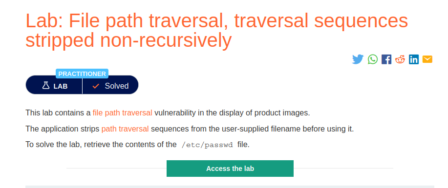
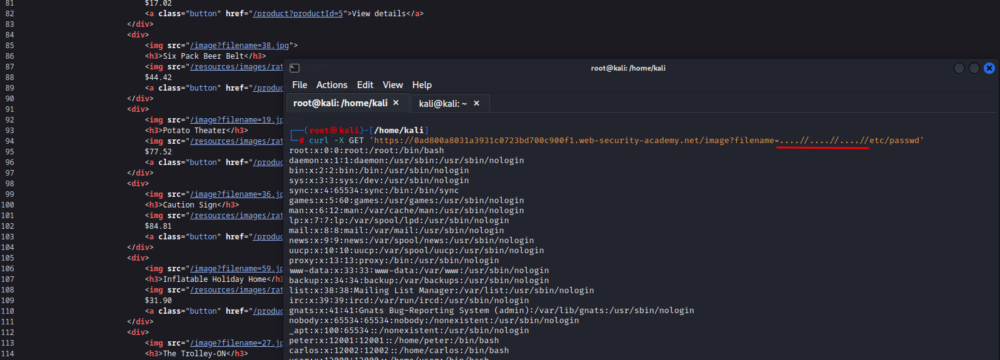

# File path traversal, traversal sequences stripped non-recursively

**Level:** <mark style="color:blue;">**Practitioner**</mark>

<figure><figcaption></figcaption></figure>

* This time the server will be cutting our patterns.
* if we pass the simple`../../../` it will be erased, and it will not get the file we want.

<figure><figcaption></figcaption></figure>

* So, because the server is just erasing the simples`../../../` you can bypass this using the following seen in the image.
