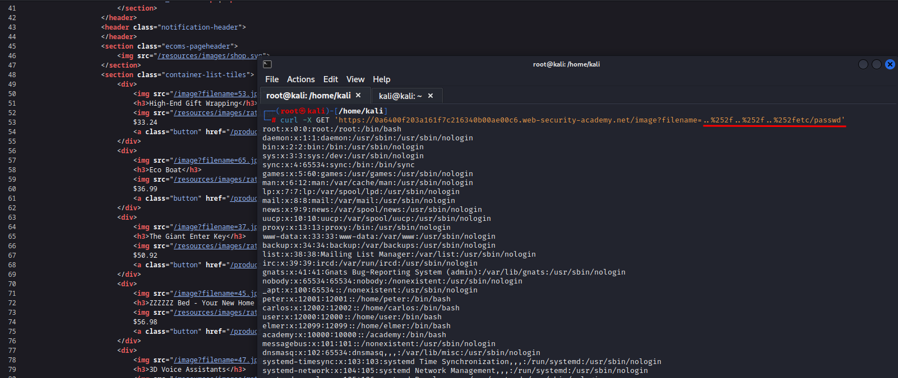

# File path traversal, traversal sequences stripped with superfluous URL-decode

**Level:** <mark style="color:blue;">**Practitioner**</mark>

<figure><figcaption></figcaption></figure>

* This challenge is simple, just URL encode `../../../etc/passwd`.

<figure><figcaption></figcaption></figure>

* The server does not interpretate the URL encode so that's why we are able to bypass this.
