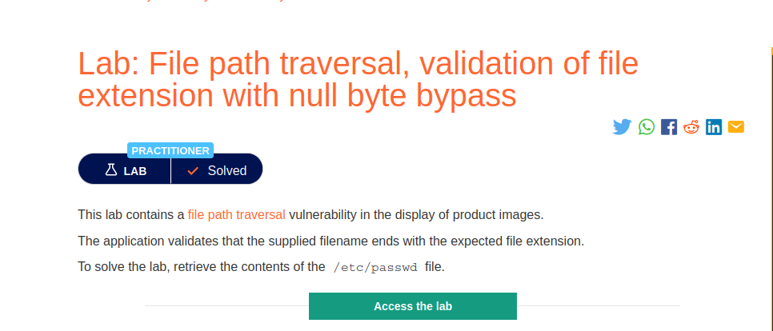
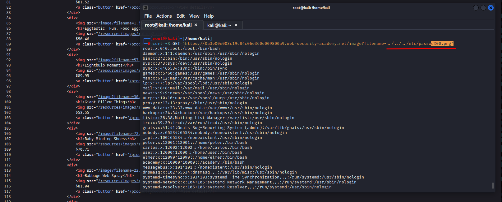

# File path traversal, validation of file extension with null byte bypass

**Level:** <mark style="color:blue;">**Practitioner**</mark>

<figure><figcaption></figcaption></figure>

* In the following challenge if we don't do something we will never get the file.

<figure><figcaption></figcaption></figure>

* This time we used the simple `../../../etc/passwd`.
* Now we need to bypass the file extension somehow, use a null char **%00** followed by .png .
