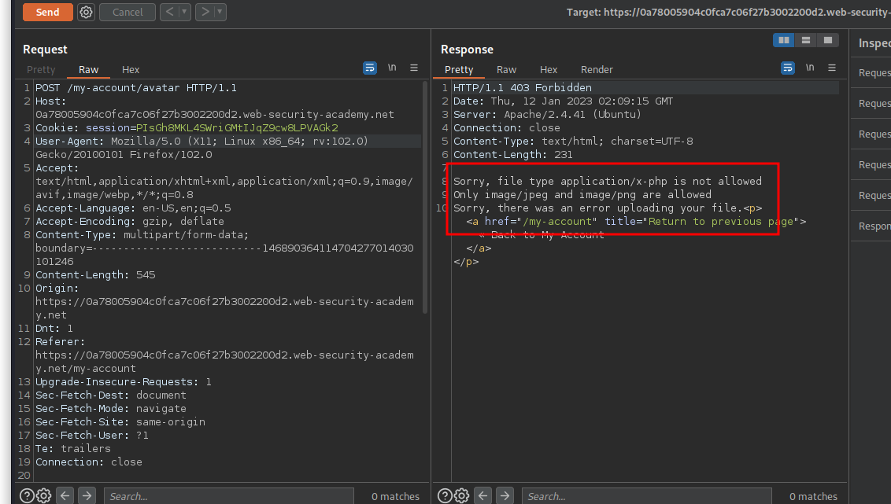

# Web shell upload via Content-Type restriction bypass

**Level:** <mark style="color:green;">**Apprentice**</mark>

<figure><figcaption></figcaption></figure>

* This time its haves a file upload restriction, and is the same objective as the first challenge
* We need to get the file content of **/home/carlos/secret.**

<figure><figcaption></figcaption></figure>

* If you try to upload the malicious file of the previous challenge, will not work
* How you can bypass this? well, if you change the file extension on your machine, you change the **Content-Type** of the requests and bypass the restriction as you can see in the following image.

<figure><figcaption></figcaption></figure>
